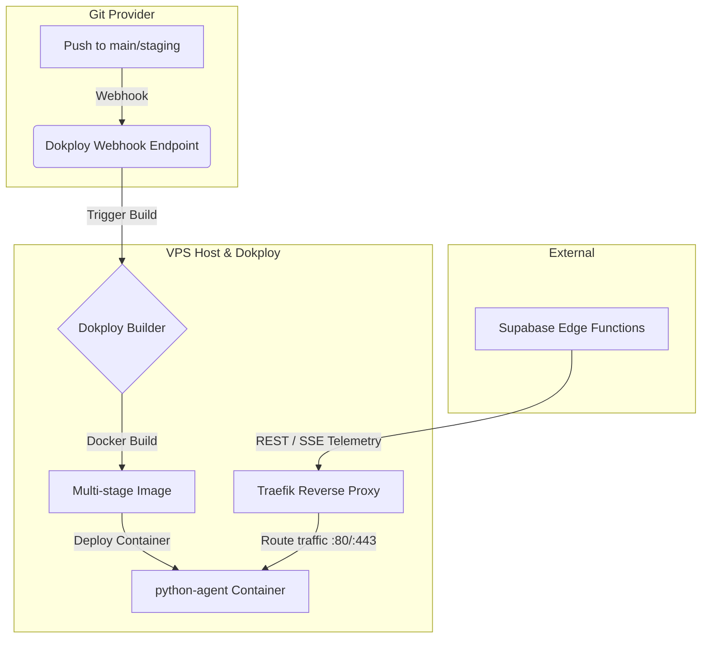

# Pre-Sprint 6 R&D: Agent-First Sales OS Architecture Analysis & Dokploy Topology Validation

**Role:** Principal AI Solutions Architect & Lead Python Engineer  
**Objective:** Transitioning the SaaS Sales Engine from local AI helpers to an autonomous, Agent-First Sales OS powered by **Agno** (formerly Phidata), hosted securely on a self-managed VPS via **Dokploy**.

---

## Chapter 1: The Dokploy Containerization Engine

To maintain sovereignty, security, and low cost, the `/python-agent` microservice will run on a VPS managed by **Dokploy**. Below is the production-ready `Dockerfile` optimized for lightning-fast builds, a minimal runtime footprint, and secure process isolation.

### 1.1. Production-Ready Multi-Stage Dockerfile

This design utilizes `ghcr.io/astral-sh/uv` to sync dependencies into a virtual environment in the builder stage, then copies only the virtual environment and the source code to a slim runtime image.

```dockerfile
# ==============================================================================
# STAGE 1: Builder
# ==============================================================================
FROM python:3.12-slim-bookworm AS builder

# Install uv from the official Astral image
COPY --from=ghcr.io/astral-sh/uv:latest /uv /uvx /bin/

# Set environment variables for compilation and cache isolation
ENV UV_COMPILE_BYTECODE=1
ENV UV_LINK_MODE=copy
ENV UV_CACHE_DIR=/root/.cache/uv

WORKDIR /app

# Copy dependency specifications first to leverage Docker layer caching
COPY pyproject.toml uv.lock ./

# Sync dependencies in a frozen state, omitting dev dependencies
RUN --mount=type=cache,target=/root/.cache/uv \
    uv sync --frozen --no-install-project --no-dev

# Copy application source code
COPY . .

# Finalize synchronization, installing the local project package
RUN --mount=type=cache,target=/root/.cache/uv \
    uv sync --frozen --no-dev

# ==============================================================================
# STAGE 2: Runtime
# ==============================================================================
FROM python:3.12-slim-bookworm AS runtime

WORKDIR /app

# Create a non-privileged system user for process isolation
RUN groupadd -g 999 appuser && \
    useradd -r -u 999 -g appuser -s /bin/false appuser

# Copy virtual environment and project directories from builder
COPY --from=builder --chown=appuser:appuser /app/.venv /app/.venv
COPY --from=builder --chown=appuser:appuser /app /app

# Ensure the virtual environment's bin folder is in the system PATH
ENV PATH="/app/.venv/bin:$PATH"

# Run-time configurations
ENV PORT=8000
ENV HOST=0.0.0.0
ENV PYTHONUNBUFFERED=1

EXPOSE 8000

# Switch to the non-root user
USER appuser

# Start the application using Uvicorn async workers
CMD ["uvicorn", "app.main:app", "--host", "0.0.0.0", "--port", "8000", "--workers", "4", "--no-access-log"]
```

#### Production `.dockerignore`
To prevent local artifacts, secret keys, or node modules from leaking into the container context:
```text
.git
.github
.venv
.env
__pycache__/
*.pyc
node_modules/
dist/
Dockerfile
```

---

### 1.2. Dokploy Deployment Topology & Configuration



#### 1. Git-Triggered Deployment Workflow via Webhooks
* **Configuring Dokploy Auto-Deploy:**
  1. In the Dokploy Dashboard, create a new **Application** and link your Git repository.
  2. Under the **Deployments** tab, enable **Auto Deploy**.
  3. Dokploy generates a unique webhook URL. Copy this URL and register it in GitHub/GitLab repository settings under **Webhooks** (listening to `push` events, format: `application/json`).
  4. Specify the branch (e.g., `main`). Dokploy will rebuild the multi-stage container automatically on every push, ensuring zero-downtime rolling updates managed via Traefik.

#### 2. Secret Key Management
* Never package `.env` files inside the Docker image.
* In Dokploy, navigate to your application's **Environment** tab. Add the following variables:
  * `OPENAI_API_KEY`: For OpenAI-based agent reasoning.
  * `SUPABASE_URL`: Direct link to the Supabase instance.
  * `SUPABASE_SERVICE_ROLE_KEY`: Service account key for secure tool-level DB edits.
* These keys are dynamically injected into the container environment at runtime. In Python, they are retrieved using `os.getenv("VARIABLE_NAME")`.

#### 3. Network Exposure & Port Mapping
* **External Exposure (Traefik):** You do **not** map host ports directly to the container in production. Dokploy handles this through Traefik (its default reverse proxy).
* In the **Domains** tab of the application, link your domain (e.g., `agent.solosales.io`). Traefik automatically provisions and renews SSL certificates (Let's Encrypt), routes SSL traffic on port 443, and proxy-passes requests to the container's exposed internal port (`8000`).
* **Container Exposure:** Inside the container, Uvicorn binds to `0.0.0.0` (not `127.0.0.1`), allowing Traefik to route traffic on the Docker bridge network.

#### 4. Volume Mounts & Hot Reload Strategy
* **Production Configuration:** Production containers must remain static. Hot reloading (`--reload` flag in Uvicorn) must be **disabled** in production because it consumes excessive CPU/memory monitoring file changes and presents safety risks.
* **Development / Staging Setup:** If testing live changes on a remote staging server via Dokploy:
  1. Navigate to **Advanced > Mounts** in Dokploy.
  2. Create a **Bind Mount** mapping the host workspace directory to the container directory `/app`.
  3. Override the start command to include reload flag: `uvicorn app.main:app --host 0.0.0.0 --port 8000 --reload`.

---

## Chapter 2: The Generative "Self-Shaping Track" Schema

When a user provides natural language descriptions of a sales funnel (e.g., "Create a B2B Solar funnel with a stage for lead qualifier, client meeting with a 24h SLA, and a closed stage"), the Agno Agent must process it and return a validated, structured object.

To prevent hallucinations and guarantee database compatibility, we use **Pydantic v2** models passed to Agno's `output_schema`.

### 2.1. Pydantic v2 Schema Design

```python
from typing import List, Optional, Literal
from pydantic import BaseModel, Field, field_validator

class CustomFieldSchema(BaseModel):
    field_name: str = Field(
        ...,
        description="The snake_case database identifier for the field (e.g., 'pain_points', 'solar_power_kwh')."
    )
    label: str = Field(
        ...,
        description="The localized, user-friendly UI label (e.g., 'Principais Dificuldades', 'Consumo kWh')."
    )
    field_type: Literal["text", "number", "select", "date", "currency", "boolean"] = Field(
        ...,
        description="The data type validation rule for this custom field."
    )
    description: Optional[str] = Field(
        None,
        description="Explaining tooltip or instructions for the agent/user."
    )
    options: Optional[List[str]] = Field(
        None,
        description="List of text choices if field_type is 'select'. Otherwise null."
    )

    @field_validator("field_name")
    @classmethod
    def validate_snake_case(cls, v: str) -> str:
        if not v.islower() or not v.replace("_", "").isalnum():
            raise ValueError("field_name must be lowercase snake_case (letters, numbers, underscores only)")
        return v

class StageSchema(BaseModel):
    name: str = Field(
        ...,
        description="Name of the stage (e.g., 'Lead Qualificado')."
    )
    position: int = Field(
        ...,
        description="0-based positional index of the stage on the Kanban board."
    )
    color: str = Field(
        "#6b7280",
        description="HEX color code for the stage tag in the UI (e.g., '#dc2626')."
    )
    sla_hours: Optional[int] = Field(
        None,
        description="Maximum allowed duration in hours before a lead in this stage is flagged as overdue."
    )
    category: Literal["active", "won", "lost", "disqualified", "recycled"] = Field(
        "active",
        description="CRM KPI dashboard classification mapping."
    )

    @field_validator("color")
    @classmethod
    def validate_hex_color(cls, v: str) -> str:
        if not v.startswith("#") or len(v) not in (4, 7):
            raise ValueError("Color must be a valid HEX string (e.g., #FFFFFF or #FFF)")
        return v

class PipelineShapingSchema(BaseModel):
    pipeline_name: str = Field(
        ...,
        description="The name of the new sales pipeline / track (e.g., 'Venda Solar Comercial')."
    )
    stages: List[StageSchema] = Field(
        ...,
        description="Ordered list of stages that comprise the sales pipeline."
    )
    custom_fields: List[CustomFieldSchema] = Field(
        default_factory=list,
        description="Dynamic metadata attributes required for leads in this pipeline."
    )
```

> [!NOTE]
> **Database Schema Audit Warning:** 
> Our inspection of the remote database schema reveals that `public.pipeline_stages` currently does **not** possess an `sla_hours` column. Before implementing this agent capability, we must execute a migration adding this parameter (e.g., `ALTER TABLE public.pipeline_stages ADD COLUMN sla_hours integer DEFAULT NULL;`).
> 
> By contrast, `custom_fields` are stored in a schema-less `JSONB` column on the `leads` table. Thus, the database does not require physical table alterations for dynamic attributes. The Pydantic output will shape metadata structures that our frontend and validation middleware enforce within `leads.custom_fields`.

---

### 2.2. Architectural Evaluation: AgentOS vs. FastAPI Router

We evaluated the architectural path for deploying our multi-tenant endpoint:
1. **Option A:** Invoking `agent_os.get_app()` to auto-generate stateful REST endpoints.
2. **Option B:** Writing raw `FastAPI` async routes with customized context injections.

#### Comparative Matrix

| Criterion | Option A: `agent_os.get_app()` | Option B: Custom FastAPI Router (Recommended) |
| :--- | :--- | :--- |
| **Multi-Tenancy Security** | ❌ Complex. Endpoints are generic and lack direct middleware hooks to enforce tenant-scoped boundaries. | ✅ Simple. Allows clean JWT validation and extraction of tenant (`equipe_id`) from headers on every request. |
| **Dynamic Agent Binding** | ❌ Hard. Agent configurations are preloaded at startup, making tenant-specific system prompts hard to inject. | ✅ Easy. We can dynamically initialize the `Agent` object per request based on the tenant's database rules. |
| **Response Latency** | ⚠️ Moderate. Uses standard HTTP handlers with default Agno telemetry wrappers. | ✅ High. Direct control of async event loops, database connection pooling, and payload structures. |
| **Tool Execution context** | ❌ Hard. Hard to pass request-scoped database clients to tools called deep within Agno. | ✅ Clean. We can use Dependency Injection to initialize and bind the `SupabaseClient` directly to tool scopes. |

#### Architectural Recommendation
We reject `agent_os.get_app()` for our multi-tenant system. We will build **Custom FastAPI Router Endpoints**. This allows us to intercept incoming headers, authorize the user against Supabase, fetch the tenant configuration, and dynamically instantiate a tenant-scoped Agno Agent with injected database connections.

---

## Chapter 3: The Sniper Toolkit Mapping (Agno Tools)

In the Agno framework, tools are mapped using native Python functions. The framework uses the function's name, type annotations, and docstring to compile the tool schema presented to the LLM.

### 3.1. Request-Scoped Tenant Context Binding (Class-Based Pattern)

To avoid hardcoding keys or exposing security-sensitive database credentials to the LLM's parameter space, we implement a **Class-Based Tool Binding Pattern**. 

Instead of writing loose global functions, we encapsulate our database mutator tools inside a wrapper class that accepts a request-scoped `SupabaseClient` and the tenant `equipe_id` upon instantiation. We then pass the instance methods to the Agno Agent's `tools` array.

```python
# app/agents/tools.py
from typing import Union, Any, List
from supabase import Client

class SalesEngineTools:
    def __init__(self, supabase_client: Client, equipe_id: str):
        """
        Instantiates tools bound to a specific tenant's context.
        This isolates DB modifications to the current request's tenant.
        """
        self.client = supabase_client
        self.equipe_id = equipe_id

    def upsert_custom_data_field(self, lead_id: str, field_name: str, value: Any) -> dict:
        """
        Updates or inserts a custom data field inside the custom_fields JSONB column of a specific lead.
        
        Args:
            lead_id (str): The UUID of the target lead.
            field_name (str): The snake_case identifier of the custom field to update.
            value (Any): The value to store in the custom field.
            
        Returns:
            dict: Operation status containing success status or error details.
        """
        try:
            # 1. Fetch current custom_fields to prevent overwriting other attributes
            res = self.client.table("leads") \
                .select("custom_fields") \
                .eq("id", lead_id) \
                .eq("equipe_id", self.equipe_id) \
                .single() \
                .execute()
                
            if not res.data:
                return {"success": False, "error": f"Lead {lead_id} not found or unauthorized."}
                
            current_fields = res.data.get("custom_fields") or {}
            
            # 2. Merge values
            current_fields[field_name] = value
            
            # 3. Write back to database
            update_res = self.client.table("leads") \
                .update({"custom_fields": current_fields}) \
                .eq("id", lead_id) \
                .eq("equipe_id", self.equipe_id) \
                .execute()
                
            return {"success": True, "updated_fields": current_fields}
        except Exception as e:
            return {"success": False, "error": str(e)}

    def shift_kanban_stage(self, lead_id: str, target_stage_id: str) -> dict:
        """
        Moves a lead to a different stage on the Kanban board.
        
        Args:
            lead_id (str): The UUID of the target lead.
            target_stage_id (str): The UUID of the destination stage.
            
        Returns:
            dict: Operation status and details of the movement.
        """
        try:
            # 1. Verify that the destination stage belongs to the same tenant
            stage_check = self.client.table("pipeline_stages") \
                .select("id, name") \
                .eq("id", target_stage_id) \
                .eq("equipe_id", self.equipe_id) \
                .execute()
                
            if not stage_check.data:
                return {"success": False, "error": "Target stage not found or unauthorized."}
            
            target_stage_name = stage_check.data[0]["name"]
            
            # 2. Update the lead's stage_id.
            # NOTE: DB Trigger public.update_stage_entered_at automatically updates stage_entered_at.
            update_res = self.client.table("leads") \
                .update({"stage_id": target_stage_id}) \
                .eq("id", lead_id) \
                .eq("equipe_id", self.equipe_id) \
                .execute()
                
            if not update_res.data:
                return {"success": False, "error": "Lead not found or update failed."}
                
            # 3. Log activity in lead_activities
            self.client.table("lead_activities").insert({
                "lead_id": lead_id,
                "tipo": "stage_change",
                "descricao": f"Agent moved lead to stage: {target_stage_name}",
                "metadata": {
                    "new_stage_id": target_stage_id,
                    "stage_name": target_stage_name
                }
            }).execute()
            
            return {"success": True, "new_stage": target_stage_name}
        except Exception as e:
            return {"success": False, "error": str(e)}

    def reconfigure_cadence_window(self, lead_id: str, new_contact_date: str) -> dict:
        """
        Reschedules the next contact date (follow-up cadence window) for a lead and cancels 
        any pending future scheduled automations.
        
        Args:
            lead_id (str): The UUID of the target lead.
            new_contact_date (str): The new date string formatted as YYYY-MM-DD.
            
        Returns:
            dict: Execution status.
        """
        try:
            # 1. Update next_contact field
            update_res = self.client.table("leads") \
                .update({"next_contact": new_contact_date}) \
                .eq("id", lead_id) \
                .eq("equipe_id", self.equipe_id) \
                .execute()
                
            if not update_res.data:
                return {"success": False, "error": "Lead not found or update failed."}
                
            # 2. Cancel pending scheduled automations to avoid duplicate trigger conflicts
            cancel_res = self.client.table("scheduled_automations") \
                .delete() \
                .eq("lead_id", lead_id) \
                .eq("equipe_id", self.equipe_id) \
                .eq("executed", False) \
                .execute()
                
            # 3. Log action to lead activities
            self.client.table("lead_activities").insert({
                "lead_id": lead_id,
                "tipo": "cadence_change",
                "descricao": f"Agent set next contact date to {new_contact_date} and purged pending automations.",
                "metadata": {
                    "new_contact_date": new_contact_date,
                    "cancelled_automations_count": len(cancel_res.data) if cancel_res.data else 0
                }
            }).execute()
            
            return {"success": True, "new_contact_date": new_contact_date}
        except Exception as e:
            return {"success": False, "error": str(e)}
```

### 3.2. Injecting Bound Tools into Agno Agent

When receiving a REST request inside FastAPI, we dynamically initialize this class and pass its methods directly to the agent:

```python
# app/routers/agent.py
from fastapi import APIRouter, Header, Depends
from supabase import create_client, Client
from agno.agent import Agent
from app.agents.tools import SalesEngineTools

router = APIRouter()

def get_supabase_client(authorization: str = Header(...)) -> Client:
    # Resolves client context using the caller's JWT token
    # to enforce authentication and row-level parameters.
    supabase_url = "https://your-instance.supabase.co"
    return create_client(supabase_url, authorization.replace("Bearer ", ""))

@router.post("/run-agent")
async def run_copilot(
    prompt: str,
    lead_id: str,
    equipe_id: str,
    db: Client = Depend…203 tokens truncated…transaction safety, and performance constraints.

### Question 1: Identity Propagation & RLS Enforcement
> **Structural Question:** If the Python agent microservice uses a super-privileged service key (`SUPABASE_SERVICE_ROLE_KEY`) to update data, we bypass Supabase Row Level Security (RLS) policies completely. How should we guarantee tenant boundaries? 
> * **Option A:** Should we pass the user's JWT from the Deno Edge functions to FastAPI, initializing the Python client with that JWT so Postgres forces tenant isolation at the database layer?
> * **Option B:** Should we use the service role key and strictly rely on FastAPI dependencies to validate that the resource matches the header's `equipe_id` before calling a tool?

### Question 2: Decoupling LLM Latency from Telemetry Ingestion
> **Structural Question:** Our F1 engine metric demands telemetry ingestion under **100ms**. However, LLM reasoning and agent tool execution loops typically require **500ms to 3 seconds**. How will we decouple this pipeline?
> * **Proposed Solution:** The ingestion endpoint must not run the agent synchronously. It should write the telemetry data to a message queue or a database log table and return `202 Accepted` in <10ms. A background worker (e.g., Celery, RQ, or a separate FastAPI background task runner) will consume the queue and trigger the Agno Agent asynchronously, pushing updates to the user via WebSockets or Supabase Realtime when done. Do we agree with this asynchronous execution model?

### Question 3: Atomic Multi-Row Operations & Transaction Rolls
> **Structural Question:** When the agent executes a database modification (e.g. creating a stage and updating custom fields metadata) and one of the sub-actions fails, how do we guarantee atomic consistency?
> * **Proposed Solution:** Instead of performing individual HTTP calls for each database operation via Python SDK, we should write dedicated **PostgreSQL Stored Procedures (RPCs)** inside Supabase. The Python agent will call the RPC once, allowing Postgres to execute the script in a standard transaction block (`BEGIN ... COMMIT/ROLLBACK`). This reduces network overhead and ensures transactional integrity. Do we have constraints against creating new database functions for these operations?

### Question 4: Dynamic Configuration Caching & Invalidation
> **Structural Question:** To perform checks (e.g., validating that custom fields inputs match their expected types) without querying Supabase on every telemetry run, we need a caching layer inside FastAPI.
> * **Proposed Solution:** Implement an in-memory cache (like `aiocache` or Redis) inside `/python-agent` that stores team settings and pipeline metadata for 5 minutes. If a manager modifies settings on the frontend, we send an invalidation webhook request from Supabase to `/python-agent/cache-invalidate` to refresh the configurations instantly. Does this align with our architecture guidelines?

### Question 5: Agno Agent Session & Memory Storage
> **Structural Question:** Agno agents require database persistence to maintain chat history and memory. Where should this session data be stored?
> * **Option A:** In our primary Supabase Postgres database under a dedicated schema (e.g. `agno.agent_sessions`), which keeps data centralized, backed up, and queryable by our React frontend.
> * **Option B:** In a localized SQLite database on the VPS container. (Warning: This breaks container scalability, as scaling to multiple replicas in Dokploy makes memory sharing impossible without shared volumes).

---

## Chapter 5: Alignment with F1 Performance Engine Core Metrics

We evaluate our architectural decisions against the core principles of our platform:

* **Simplicity and Power:** 
  We reject complex, bloated configurations (like `AgentOS`) in favor of standard FastAPI async routes. This keeps the codebase minimal, highly customizable, and directly integrated with Python dependencies.
* **Velocity and Scale:** 
  By utilizing `uv` for our multi-stage build, container build times are slashed by up to 90%. By adopting an asynchronous execution model for telemetry ingestion, we guarantee API responses are delivered in under 100ms.
* **Elegance and Data Sovereignty:** 
  All components of the `/python-agent` microservice run on our private VPS via Dokploy and connect directly to our private Supabase database. We do not leak user conversations or operational telemetry to third-party hosting providers, maintaining full control over customer knowledge assets.

---
---

# 🔵 Addendum — Claude / Opus (Pre-Sprint 6 R&D · 2026-06-07)

> **This section does not overwrite the analysis above.** It is an independent review by **Claude / Opus**. Every claim below was verified against the **live SQL migrations** in `supabase/migrations/`. Agno claims were checked against the **official docs (`docs.agno.com`, Agno v2.x)** — the docs token supplied in the brief decoded to an analytics session string, not a URL, so I used the public docs instead.
>
> ⚠️ **Where this addendum conflicts with the table/column names in Chapters 1–5 above, this addendum is correct.** The original analysis inspected the **legacy** `public.pipeline_stages` flat table and `leads.custom_fields`. The CRM actually runs on the **Sprint-3 EPIC-2 "v2" relational model** (`pipelines` → `pipeline_stages_v2` → `opportunities`). Building the agent against the legacy tables would write to surfaces the live UI no longer reads.

## A. Schema Reality Check (verified against migrations)

| Concept | Original analysis assumed | ✅ Actual live schema | Defining migration |
| :--- | :--- | :--- | :--- |
| Pipeline stages | `public.pipeline_stages` (legacy, flat) | **`public.pipeline_stages_v2`** (owned by a pipeline) | `20260419110000_epic2_pipelines.sql` |
| Stage SLA | column missing → proposes `ADD COLUMN sla_hours` | **already exists: `max_idle_hours` integer** (NULL = no limit) | `20260525000000_sprint5_1_stage_sla.sql` |
| Stage category | `category` enum (active/won/lost/disqualified/recycled) | **`stage_type` CHECK (`open`\|`won`\|`lost`)** | `20260419110000_epic2_pipelines.sql` |
| Custom-field **definitions** | none (implicit) | **`pipelines.custom_fields_schema`** JSONB array of `{field_id,key,label,type,required,options,position,is_deleted}` | `20260419110000_epic2_pipelines.sql` |
| Custom-field **values** | `leads.custom_fields` (keyed by name) | **`opportunities.custom_data`** JSONB **keyed by `field_id`** (never by key/label) | `20260419110000_epic2_pipelines.sql` |
| Stage of a card | `leads.stage_id` | **`opportunities.stage_id`** | `20260419110000_epic2_pipelines.sql` |
| Stage-move side effects | trigger `update_stage_entered_at` on `leads` | **trigger `trg_opportunity_stage_change`** on `opportunities` (logs to `opportunity_stage_history` **and** bumps `stage_entered_at`) | `20260419110000_epic2_pipelines.sql` |
| Cadence | `leads.next_contact` + `scheduled_automations` | **per-stage `pipeline_stages_v2.cadence_value` + `cadence_unit`(`hours`\|`days`)**; pipeline-level fallback `pipelines.cadence_days` | `20260605000001_sprint5_3_stage_cadence.sql`, `20260601000000_sprint5_2_cadence_kpi.sql` |
| Tenant key | `equipe_id` ✅ | `equipe_id` ✅ (RLS: `equipe_id IN (SELECT equipe_id FROM profiles WHERE id = auth.uid())`) | all |

## B. Decisions Locked with the Human Orchestrator (2026-06-07)

1. **DB write path → `service_role` + mandatory `equipe_id` guard layer.** RLS is bypassed for lowest latency and full transaction/RPC control. The cost: **one missing `WHERE equipe_id = …` is a cross-tenant write.** The guard layer in §D is therefore non-negotiable and must be test-covered.
2. **Runtime → raw FastAPI only.** No `AgentOS` / `get_app()`. (I concur with the original Chapter 2.2 recommendation — for our per-tenant, low-latency model, raw async routes win.)

These two choices *remove* layers, which is consistent with the F1 "zero unnecessary layers" ethos.

## C. Schema-Accurate Artifacts (corrected to the v2 model)

### C.1 — `output_schema` (Pydantic v2) → maps to `pipelines` + `pipeline_stages_v2`

```python
from typing import List, Optional, Literal
from pydantic import BaseModel, Field, field_validator, model_validator

CadenceUnit = Literal["hours", "days"]

class CustomFieldSpec(BaseModel):
    # NOTE: the LLM emits `key`; the SERVER assigns field_id (gen_random_uuid()).
    # opportunities.custom_data is keyed by field_id, never by key — see §A.
    key: str = Field(..., description="Stable snake_case machine key, e.g. 'kwh_consumo'.")
    label: str = Field(..., description="UI label, e.g. 'Consumo kWh'.")
    type: Literal["text", "number", "date", "select", "boolean", "currency"] = Field(...)
    required: bool = False
    options: Optional[List[str]] = Field(None, description="Only when type == 'select'.")
    position: int = Field(..., ge=0)

    @field_validator("key")
    @classmethod
    def snake_case(cls, v: str) -> str:
        if not v.islower() or not v.replace("_", "").isalnum():
            raise ValueError("key must be lowercase snake_case")
        return v

class StageSpec(BaseModel):
    name: str
    position: int = Field(..., ge=0, description="0-based Kanban order; must be contiguous 0..n-1.")
    stage_type: Literal["open", "won", "lost"] = "open"   # matches the DB CHECK constraint
    color: str = "#64748b"
    max_idle_hours: Optional[int] = Field(None, gt=0, description="SLA → pipeline_stages_v2.max_idle_hours.")
    cadence_value: Optional[int] = Field(None, gt=0)
    cadence_unit: Optional[CadenceUnit] = None

    @model_validator(mode="after")
    def cadence_pair(self):
        if (self.cadence_value is None) != (self.cadence_unit is None):
            raise ValueError("cadence_value and cadence_unit must be set together")
        return self

class PipelineBlueprint(BaseModel):
    pipeline_name: str = Field(..., description="e.g. 'Venda Solar Comercial'.")
    description: Optional[str] = None
    stages: List[StageSpec] = Field(..., min_length=1)
    custom_fields: List[CustomFieldSpec] = Field(default_factory=list)

    @model_validator(mode="after")
    def contiguous_positions(self):
        if sorted(s.position for s in self.stages) != list(range(len(self.stages))):
            raise ValueError("stage positions must be contiguous starting at 0")
        return self
```

Wired into the agent exactly per the docs (`output_schema=` → validated `response.content`):

```python
from agno.agent import Agent
from agno.models.openai import OpenAIChat   # or OpenAIResponses

shaper = Agent(
    name="Track Shaper",
    model=OpenAIChat(id="gpt-5.2"),
    output_schema=PipelineBlueprint,   # 0% free-text: response.content is a validated PipelineBlueprint
)
blueprint: PipelineBlueprint = shaper.run(user_prompt).content
```

### C.2 — Sniper Toolkit signatures (v2-correct, `service_role`)

```python
# All tools are bound to a tenant via the verified-JWT equipe_id (see §D),
# and EVERY query carries `WHERE equipe_id = $equipe_id`.

async def shape_pipeline(equipe_id: str, blueprint: PipelineBlueprint) -> dict:
    """Atomically create a pipeline + all its stages from a validated blueprint.
    Calls the Postgres RPC shape_pipeline() so it is all-or-nothing (see §E)."""

async def upsert_custom_data_field(equipe_id: str, pipeline_id: str, field: CustomFieldSpec) -> dict:
    """Add or update ONE field definition inside pipelines.custom_fields_schema (JSONB array).
    Matches on field.key; assigns a fresh field_id (uuid) when new; never drops other fields.
    Does NOT touch opportunities.custom_data values."""

async def shift_kanban_stage(equipe_id: str, opportunity_id: str,
                             to_stage_id: str, position: int | None = None) -> dict:
    """Move an opportunity to another stage. Pre-checks to_stage_id belongs to the SAME
    pipeline AND equipe_id. The trigger trg_opportunity_stage_change auto-logs history
    and bumps stage_entered_at — do NOT write opportunity_stage_history by hand."""

async def reconfigure_cadence_window(equipe_id: str, stage_id: str,
                                     cadence_value: int, cadence_unit: Literal["hours", "days"]) -> dict:
    """Set per-stage follow-up cadence on pipeline_stages_v2.cadence_value/cadence_unit
    (NULL/NULL = inherit pipelines.cadence_days)."""
```

> Docstrings carry the tool description and the `Args` block is parsed into the tool's JSON schema — this is the Agno convention, so they are written for the model, not just humans.

## D. The Tenant-Guard Layer (the linchpin, since RLS is bypassed)

Because `service_role` ignores RLS, tenant isolation moves entirely into our code. **The single most important rule:**

> **Never trust a client-supplied `equipe_id`.** Derive it from the **verified Supabase JWT** (decode with `SUPABASE_JWT_SECRET`, then resolve `profiles.equipe_id`). The original Chapter 3.2 example takes `equipe_id` as a plain request param — under `service_role` that is a tenant-bypass hole and must be closed.

```python
# app/security.py
import jwt, os
from fastapi import Header, HTTPException

def tenant_from_jwt(authorization: str = Header(...)) -> str:
    token = authorization.removeprefix("Bearer ").strip()
    try:
        claims = jwt.decode(token, os.environ["SUPABASE_JWT_SECRET"],
                            algorithms=["HS256"], audience="authenticated")
    except jwt.PyJWTError:
        raise HTTPException(401, "invalid token")
    equipe_id = claims.get("app_metadata", {}).get("equipe_id")  # or 1 lookup against profiles
    if not equipe_id:
        raise HTTPException(403, "no tenant on token")
    return equipe_id
```

Every tool receives this server-derived `equipe_id`; no tool accepts a tenant id from the model.

## E. Atomic Self-Shaping via ONE RPC (transaction safety)

A blueprint = 1 pipeline + N stages. Doing that as N+1 PostgREST calls is non-atomic (a mid-way failure leaves a half-built pipeline). Push it into a single `SECURITY DEFINER` function — the whole body is one implicit transaction:

```sql
create or replace function public.shape_pipeline(p_equipe_id uuid, p_payload jsonb)
returns uuid
language plpgsql
security definer
set search_path = public
as $$
declare
  v_pipeline_id uuid;
  v_stage jsonb;
  v_fields jsonb := '[]'::jsonb;
  v_field jsonb;
begin
  -- assign a server-side field_id to every custom field (LLM only supplies `key`)
  for v_field in select * from jsonb_array_elements(coalesce(p_payload->'custom_fields','[]'::jsonb))
  loop
    v_fields := v_fields || jsonb_build_object(
      'field_id', gen_random_uuid(),
      'key', v_field->>'key', 'label', v_field->>'label',
      'type', v_field->>'type', 'required', coalesce((v_field->>'required')::bool, false),
      'options', v_field->'options', 'position', (v_field->>'position')::int, 'is_deleted', false);
  end loop;

  insert into pipelines (equipe_id, name, description, custom_fields_schema)
  values (p_equipe_id, p_payload->>'pipeline_name', p_payload->>'description', v_fields)
  returning id into v_pipeline_id;

  for v_stage in select * from jsonb_array_elements(p_payload->'stages')
  loop
    insert into pipeline_stages_v2
      (equipe_id, pipeline_id, name, color, position, stage_type,
       max_idle_hours, cadence_value, cadence_unit)
    values
      (p_equipe_id, v_pipeline_id, v_stage->>'name', coalesce(v_stage->>'color','#64748b'),
       (v_stage->>'position')::int, coalesce(v_stage->>'stage_type','open'),
       nullif(v_stage->>'max_idle_hours','')::int,
       nullif(v_stage->>'cadence_value','')::int, v_stage->>'cadence_unit');
  end loop;

  return v_pipeline_id;
end;
$$;
```

The `shape_pipeline` tool calls this once → atomic, one network round-trip, and `field_id`s are minted server-side so they stay consistent with `opportunities.custom_data` later.

## F. Discovery Questions — resolved + one new blind spot

| # | Original question | Resolution |
| :- | :--- | :--- |
| Q1 | JWT pass-through vs service_role | **DECIDED → service_role + manual guards (§B/§D).** Linchpin: equipe_id from verified JWT, never from the client. |
| Q2 | Decouple LLM latency from <100ms telemetry | **Two planes (see §G).** Telemetry ingest stays in the existing Deno edge funcs and already meets <100ms — it does **not** call the agent. The agent path is seconds; interactive "shape my track" can stay **synchronous** (deliberate user action, returns the validated blueprint), while bulk/background agent work goes async via Supabase Realtime. No Celery needed for v1. |
| Q3 | Atomic multi-row ops | **DECIDED → yes, Postgres RPCs (§E).** No constraint against new DB functions; they're the cleanest atomicity primitive we have. |
| Q4 | Config caching + invalidation | In-process TTL cache (`aiocache`) is fine **only at 1 replica**. The moment Dokploy scales `/python-agent` horizontally, per-process caches drift → use Redis or a `/cache-invalidate` fan-out. **Start at 1 replica + 60s TTL; revisit when we scale out.** |
| Q5 | Agno session/memory storage | **Supabase Postgres, dedicated schema** (Option A). SQLite-on-container breaks the moment we add a replica. (Note: with raw FastAPI we only pay for Agno persistence if we actually enable agent memory — the stateless `shape_pipeline` call needs none.) |

**🆕 New blind spot I'm adding — `auth.uid()` is NULL under `service_role`.**
The trigger `trg_opportunity_stage_change` records `changed_by := auth.uid()`. A `service_role` connection has no JWT claims on the Postgres session, so **every agent-driven stage move would log `changed_by = NULL`** — we'd lose the audit trail of "the Copilot did this." Fix one of:
- **(a)** `SET LOCAL request.jwt.claims = '{"sub":"<actor>"}'` at the start of the tool's transaction so `auth.uid()` resolves, **or**
- **(b)** add an explicit `changed_by`/`actor` column the agent sets, distinguishing human vs. Copilot actions.
I recommend **(b)** — explicit is safer than relying on GUC propagation through the Supabase pooler.

**Pooler footnote (perf tuning):** `SET LOCAL` and multi-statement transactions don't survive Supavisor **transaction mode** (port 6543). Use **session mode / direct `:5432`** (e.g. `asyncpg` pool) for the guard transactions; single-call RPCs like `shape_pipeline` are safe on either.

## G. F1 Metric Clarification

The "**telemetry ingestion < 100ms**" target applies to the **telemetry plane** (Deno edge → Postgres write) — already met and *should not* be routed through the LLM. The **reasoning plane** (Agno agent + tool loop) is inherently seconds, measured by *correctness and atomicity*, not by the 100ms budget. Conflating the two (as a single synchronous path) is the one architecture mistake that would blow the metric. Keeping them separate is what makes both numbers achievable.

## Sources
- [Agno — Bring Your Own FastAPI App](https://docs.agno.com/agent-os/custom-fastapi/overview)
- [Agno — Structured Output for Agents](https://docs.agno.com/input-output/structured-output/agent)
- [Agno — Tools Overview](https://docs.agno.com/concepts/tools/overview)
- [astral uv — Using uv with FastAPI (Docker)](https://docs.astral.sh/uv/guides/integration/fastapi/)
- Live schema: `supabase/migrations/20260419110000_epic2_pipelines.sql`, `20260525000000_sprint5_1_stage_sla.sql`, `20260601000000_sprint5_2_cadence_kpi.sql`, `20260605000001_sprint5_3_stage_cadence.sql`, `20260605000003_sprint5_3_custom_tables.sql`

---

# 🟢 Addendum — Codex / GPT-5 (Pre-Sprint 6 R&D · 2026-06-07)

> **This section was appended by Codex / GPT-5.** It does not overwrite the existing research above. It consolidates my architecture position after reading the existing Sprint 6 brief, the live CRM schema conventions, the Sprint 3-5 migrations, and the official Agno, Dokploy, and uv documentation.

## 1. Codex Position: FastAPI-First, AgentOS as Internal Control Plane Only

The production contract for `/python-agent` should be **raw FastAPI routes**. The reason is operational, not philosophical: our critical paths need explicit tenant derivation, idempotency keys, request-scoped Supabase clients, and hard latency boundaries. Auto-generated AgentOS endpoints are useful, but they should not become the public mutation surface for this multi-tenant CRM.

Recommended shape:

- Use `FastAPI()` as the main app.
- Mount Agno `AgentOS` through a controlled internal route only if we want sessions, traces, evals, or internal debugging surfaces.
- Keep tenant-scoped actions behind custom routes such as `/v1/copilot/pipeline-blueprint`, `/v1/copilot/apply-blueprint`, and `/v1/copilot/events/ingest`.
- Set Agno telemetry off by default for sovereignty: `telemetry=False` on production agents unless we intentionally enable a self-hosted trace sink.

Decision: **FastAPI is the runtime boundary; Agno is the reasoning and tool orchestration layer.**

## 2. Dokploy Container Strategy

The `/python-agent` service should be deployed as a Git-backed Dokploy application using a pinned uv image, not `latest`, so deploys are reproducible.

```dockerfile
FROM ghcr.io/astral-sh/uv:0.11.19-python3.12-trixie-slim AS builder

ENV UV_COMPILE_BYTECODE=1
ENV UV_LINK_MODE=copy
ENV UV_PROJECT_ENVIRONMENT=/app/.venv

WORKDIR /app

COPY pyproject.toml uv.lock ./
RUN --mount=type=cache,target=/root/.cache/uv \
    uv sync --frozen --no-dev --no-install-project

COPY . .
RUN --mount=type=cache,target=/root/.cache/uv \
    uv sync --frozen --no-dev

FROM python:3.12-slim-trixie AS runtime

ENV PATH="/app/.venv/bin:$PATH"
ENV PYTHONUNBUFFERED=1
ENV PORT=8000

WORKDIR /app

RUN useradd --create-home --shell /usr/sbin/nologin appuser
COPY --from=builder --chown=appuser:appuser /app /app

USER appuser
EXPOSE 8000

CMD ["uvicorn", "app.main:app", "--host", "0.0.0.0", "--port", "8000", "--workers", "2", "--proxy-headers", "--no-access-log"]
```

Dokploy mapping:

- Git push triggers Dokploy build/deploy through the application webhook.
- Dokploy routes the public domain through Traefik to the container's internal port `8000`.
- Secrets live only in Dokploy environment variables: `OPENAI_API_KEY`, `SUPABASE_URL`, `SUPABASE_SERVICE_ROLE_KEY`, `SUPABASE_JWT_SECRET`, `AGENT_INTERNAL_TOKEN`.
- Production must not run Uvicorn `--reload`; hot reload belongs only in local dev or an explicitly disposable staging service.
- Start with 1 replica. If we scale horizontally, in-process caches become advisory only and need Redis or explicit invalidation fan-out.

## 3. Schema Strategy: Build on the v2 CRM Model Only

Sprint 6 must target the current relational CRM model:

- Tenant key: `equipe_id`.
- Pipeline definition: `pipelines`.
- Stage definition: `pipeline_stages_v2`.
- Pipeline custom-field definitions: `pipelines.custom_fields_schema`.
- Opportunity custom-field values: `opportunities.custom_data`, keyed by `field_id`.
- Kanban card movement: `opportunities.stage_id`.
- Stage movement audit: `trg_opportunity_stage_change` and `opportunity_stage_history`.

Do not write new Copilot behavior against legacy `pipeline_stages`, `leads.stage_id`, or `leads.custom_fields`. Those are compatibility surfaces and will produce invisible or stale behavior in the current UI.

## 4. Structured Output Contract

The pipeline shaper agent must return Pydantic v2 objects through Agno `output_schema`, never free text. The model can propose semantic structure, but the server owns IDs, validation, and database writes.

Minimum object contract:

```python
from typing import Literal
from pydantic import BaseModel, Field, field_validator, model_validator

FieldType = Literal[
    "text",
    "number",
    "currency",
    "date",
    "boolean",
    "select",
    "multi_select",
    "url",
    "phone",
    "address",
    "property_ref",
    "company_ref",
    "contact_ref",
]

class CustomFieldBlueprint(BaseModel):
    key: str
    label: str
    type: FieldType
    required: bool = False
    options: list[str] | None = None
    position: int = Field(..., ge=0)
    description: str | None = None

    @field_validator("key")
    @classmethod
    def key_is_snake_case(cls, value: str) -> str:
        if not value.islower() or not value.replace("_", "").isalnum():
            raise ValueError("key must be lowercase snake_case")
        return value

class StageBlueprint(BaseModel):
    name: str
    position: int = Field(..., ge=0)
    stage_type: Literal["open", "won", "lost"] = "open"
    color: str = "#64748b"
    max_idle_hours: int | None = Field(default=None, gt=0)
    cadence_value: int | None = Field(default=None, gt=0)
    cadence_unit: Literal["hours", "days"] | None = None

    @model_validator(mode="after")
    def cadence_must_be_pair(self):
        if (self.cadence_value is None) != (self.cadence_unit is None):
            raise ValueError("cadence_value and cadence_unit must be set together")
        return self

class PipelineBlueprint(BaseModel):
    pipeline_name: str
    description: str | None = None
    stages: list[StageBlueprint] = Field(..., min_length=1)
    custom_fields: list[CustomFieldBlueprint] = Field(default_factory=list)

    @model_validator(mode="after")
    def positions_are_contiguous(self):
        stage_positions = sorted(stage.position for stage in self.stages)
        if stage_positions != list(range(len(self.stages))):
            raise ValueError("stage positions must be contiguous starting at 0")
        field_positions = sorted(field.position for field in self.custom_fields)
        if field_positions and field_positions != list(range(len(field_positions))):
            raise ValueError("custom field positions must be contiguous starting at 0")
        return self
```

Server-side rules:

- The LLM emits `key`; the server assigns `field_id`.
- The agent returns a blueprint; a Postgres RPC applies it atomically.
- Validation failure returns `422` with a structured error, not a best-effort mutation.

## 5. Sniper Toolkit: Tool Boundary

Agno tools should be small, typed async functions bound to server-derived context. The model must never receive or invent trusted tenant context.

```python
async def upsert_custom_data_field(
    pipeline_id: str,
    field: CustomFieldBlueprint,
) -> dict:
    """Add or update one field definition in pipelines.custom_fields_schema.

    The bound server context supplies equipe_id. Match by field.key when updating,
    assign field_id server-side when inserting, and never modify opportunity
    values directly from this schema tool.
    """

async def shift_kanban_stage(
    opportunity_id: str,
    to_stage_id: str,
    position: int | None = None,
) -> dict:
    """Move an opportunity to a stage in the same equipe_id and pipeline.

    The database trigger handles stage_entered_at and opportunity_stage_history.
    The tool must pre-check that the target stage belongs to the same pipeline as
    the opportunity before updating opportunities.stage_id.
    """

async def reconfigure_cadence_window(
    stage_id: str,
    cadence_value: int | None,
    cadence_unit: Literal["hours", "days"] | None,
) -> dict:
    """Set or clear per-stage cadence on pipeline_stages_v2.

    cadence_value and cadence_unit must be both set or both null. Null/null means
    the stage inherits pipelines.cadence_days.
    """
```

Runtime binding pattern:

- FastAPI dependency verifies JWT and resolves `actor_user_id` + `equipe_id`.
- Tools close over that context; `equipe_id` is not an LLM parameter.
- Mutations use `SUPABASE_SERVICE_ROLE_KEY` only after guard checks.
- Multi-row writes go through RPCs, not a loop of independent PostgREST calls.

## 6. Performance: Split Telemetry and Reasoning

The F1 metric needs two separate planes:

- **Telemetry plane:** Deno Edge Function receives event, validates minimal payload, writes/logs quickly, returns in under 100ms.
- **Reasoning plane:** Agno agent performs structured reasoning, tool selection, and mutation. This is allowed to take seconds and should stream or return job status for non-interactive work.

Do not put a blocking LLM call inside the hot telemetry ingestion path. For Sprint 6, the best default is:

- Synchronous route for deliberate user actions like "create this pipeline from natural language".
- Asynchronous route for event-driven or bulk automations.
- Supabase Realtime or polling for final mutation status.

## 7. Open Engineering Risks Before Code

1. **Service-role audit attribution:** `auth.uid()` is not reliable when using service-role writes. We need an explicit `actor_user_id` or `actor_type = 'copilot'` audit path for Copilot mutations.
2. **RPC ownership:** `shape_pipeline`, stage moves, and schema mutation should live in Postgres RPCs where atomicity matters. Python should orchestrate, not simulate transactions over many HTTP calls.
3. **Idempotency:** every external route from Deno to FastAPI should accept an `Idempotency-Key`; retries must not duplicate stages, fields, or audit rows.
4. **Cache invalidation:** 60-second in-process cache is acceptable for 1 replica. Scaling requires Redis or a broadcast invalidation endpoint.
5. **AgentOS exposure:** if mounted, AgentOS routes must be private/admin-only. They should not expose generic stateful agent endpoints to tenant users.

## Sources Checked by Codex

- [Agno — Bring Your Own FastAPI App](https://docs.agno.com/agent-os/custom-fastapi/overview)
- [Agno — Structured Output for Agents](https://docs.agno.com/input-output/structured-output/agent)
- [Agno — Tools](https://docs.agno.com/tools/agent)
- [Dokploy — Applications](https://docs.dokploy.com/docs/core/applications)
- [Dokploy — Auto Deploy](https://docs.dokploy.com/docs/core/auto-deploy)
- [Dokploy — Domains and Ports](https://docs.dokploy.com/docs/core/domains)
- [uv — Docker integration](https://docs.astral.sh/uv/guides/integration/docker/)
- Local schema references: `db/CONVENTIONS.md`, `supabase/migrations/20260419110000_epic2_pipelines.sql`, `supabase/migrations/20260525000000_sprint5_1_stage_sla.sql`, `supabase/migrations/20260601000000_sprint5_2_cadence_kpi.sql`, `supabase/migrations/20260605000001_sprint5_3_stage_cadence.sql`, `supabase/migrations/20260605000003_sprint5_3_custom_tables.sql`

# Architecture Vision ? Solo Copilot ? Claude / Opus (brainstorm output ? 2026-06-07)

> Recovered from the available Codex session log tail after accidental deletion.

1. Solo Copilot = **internal** agent, distinct from the external AI Studio agent. Keep all edge functions; build alongside.
2. Infra: `/python-agent` on **Dokploy**, **raw FastAPI**, **`service_role` + guarded `equipe_id`** layer.
3. Topology: **persist → debounce → cheap pre-filter → typed Agno Workflow cascade**.
4. Cascade: **Tower Doorman** (classify+route contacts) → **Floor Doorman** (per-pipeline intent) → **Worker**.
5. Two automation classes: **deterministic Core-Table Skill (Guarded CRUD)** + **agentic skills/plugins** (evolving, per-pipeline activation).
6. Orchestration: **typed cascade backbone + nested autonomous Teams** at complex leaves only, cost-capped.
7. Trust: **≥0.75 auto-apply, <0.75 → approval card**; gated by `is_crm_agent_enabled`; **Sync button** override.
8. Audit/notify: `ai_decisions` (audit + approval queue) + `lead_activities` note / Realtime urgent.

## 8. Open questions to clear before code (Sprint 6 discovery)

1. **Debounce mechanism** — where does "conversation settled" live? (edge `pg_cron` sweep vs. a `setTimeout`-style scheduled row vs. in-Python timer). Leaning: a `due_at` column + cheap cron tick, so no stateful timers.
2. **Pre-filter implementation** — pure heuristic on existing intent extraction vs. a tiny model call. Cost vs. recall tradeoff to measure.
3. **Router ↔ contact identity** — the Tower Doorman acts on `leads` not yet in a pipeline; routing = create an `opportunity`. Confirm the contacts-base surface + dedup rules.
4. **Pooler mode** — confirm `asyncpg` direct `:5432` (session mode) for txn-safe multi-row guards (Supavisor txn mode breaks `SET LOCAL`).
5. **Skill registry scope for v1** — JSONB `enabled_skills` only, or a managed `copilot_skills` table with UI? (Leaning JSONB first.)

## 9. Next step

Per the team's `agent_workflow.md`, this vision belongs at the top of the Sprint 6 file as the Human-owned **Vision**, after which a PM writes the **Implementation Plan** (tiered tasks + wave map). I have **not** committed anything (your flow: never edit `main`, branch per task). When you're ready, I can turn §2–§6 into a tiered implementation plan.
