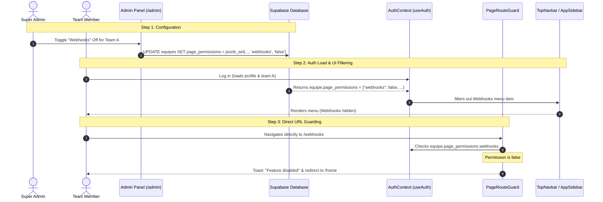

# Sprint 6.2 Implementation Plan: Team Page & Feature Permissioning System

> **Required Sub-Skill:** Use `superpowers:subagent-driven-development` or `superpowers:executing-plans` to execute this plan task-by-task. Use the checkboxes (`- [ ]`) to track progress.

## 🎯 Goal
Implement a dynamic page and feature permissioning system that allows **Super Admins** to enable or disable specific portal pages (such as **Webhooks, AI Studio, Billing, Toolkit, Clube Solo, and Suporte**) for individual teams (tenants). Hiding a page should filter it out from navigation menus (top navbar & sidebar), block direct URL navigation via a React Router route guard, and restrict corresponding backend/API operations.

---

## 🏗️ Architecture & Data Flow



---

## 🛠️ Task 1: Database Schema Migration

Create a new Supabase migration to store page permissions at the team level and secure the database.

**Files to Create:**
- `supabase/migrations/20260617000000_add_team_page_permissions.sql`

- [ ] **Step 1.1: Add `page_permissions` column to `public.equipes`**
  Alter the `public.equipes` table to include a JSONB column representing the enabled pages, defaulting all pages to `true`.
  ```sql
  ALTER TABLE public.equipes 
  ADD COLUMN IF NOT EXISTS page_permissions JSONB NOT NULL DEFAULT '{
    "webhooks": true,
    "ai_studio": true,
    "billing": true,
    "toolkit": true,
    "clube": true,
    "suporte": true
  }'::jsonb;
  ```

- [ ] **Step 1.2: Backfill existing teams**
  Ensure any existing team records are updated to have the default permissions structure so no null pointer exceptions occur in the frontend:
  ```sql
  UPDATE public.equipes 
  SET page_permissions = '{
    "webhooks": true,
    "ai_studio": true,
    "billing": true,
    "toolkit": true,
    "clube": true,
    "suporte": true
  }'::jsonb
  WHERE page_permissions IS NULL OR page_permissions = '{}'::jsonb;
  ```

- [ ] **Step 1.3: Update Row Level Security (RLS) on webhook tables**
  Restructure RLS policies on webhook tables to restrict read/write access if the team does not have the webhook feature enabled:
  ```sql
  -- Drop existing insert/update policies for webhook_configs and recreate them with permission checks:
  CREATE OR REPLACE POLICY "Enable read for webhook_configs based on team permission" 
  ON public.webhook_configs
  FOR SELECT 
  TO authenticated
  USING (
    equipe_id IN (
      SELECT id FROM public.equipes 
      WHERE (page_permissions->>'webhooks')::boolean = true
    )
  );

  CREATE OR REPLACE POLICY "Enable write for webhook_configs based on team permission" 
  ON public.webhook_configs
  FOR ALL
  TO authenticated
  USING (
    equipe_id IN (
      SELECT id FROM public.equipes 
      WHERE (page_permissions->>'webhooks')::boolean = true
    )
  )
  WITH CHECK (
    equipe_id IN (
      SELECT id FROM public.equipes 
      WHERE (page_permissions->>'webhooks')::boolean = true
    )
  );
  ```

---

## 🛠️ Task 2: Edge Function Protection

Ensure the Inbound webhook edge function rejects payloads if the team's webhook page is disabled.

**Files to Modify:**
- [supabase/functions/crm-webhook/index.ts](file:///C:/Users/mateus/SaaS%20Sales%20Engine%20-%20v1.0%20%28Supabase%29/saas-salesengine-v1.0/supabase/functions/crm-webhook/index.ts)

- [ ] **Step 2.1: Check team page permissions in Edge Function**
  Inside the webhook endpoint (after looking up the config and target team `equipe`), query or check the `page_permissions` column. If `"webhooks": false` is configured, return an immediate `403 Forbidden` response:
  ```typescript
  // Inside the config fetch block
  const { data: equipe, error: equipeError } = await supabase
    .from('equipes')
    .select('id, page_permissions')
    .eq('id', config.equipe_id)
    .single();

  if (equipe?.page_permissions?.webhooks === false) {
    return new Response(
      JSON.stringify({ error: "Webhook feature is disabled for this team." }),
      { status: 403, headers: { "Content-Type": "application/json" } }
    );
  }
  ```

---

## 🛠️ Task 3: Frontend Context Integration

Ensure team permissions are available across the entire frontend application context.

**Files to Modify:**
- [src/contexts/AuthContext.tsx](file:///C:/Users/mateus/SaaS%20Sales%20Engine%20-%20v1.0%20%28Supabase%29/saas-salesengine-v1.0/src/contexts/AuthContext.tsx)

- [ ] **Step 3.1: Update the `Equipe` interface**
  Extend the `Equipe` interface to declare `page_permissions`:
  ```typescript
  interface Equipe {
    id: string;
    nome: string;
    niche: string | null;
    gpt_maker_agent_id: string | null;
    limite_creditos: number;
    creditos_avulsos: number;
    webhook_secret: string | null;
    is_crm_agent_enabled: boolean;
    page_permissions?: Record<string, boolean>; // Add this line
  }
  ```
  *(Note: The fetch queries inside `AuthContext.tsx` already perform `.select("*")`, so this column will load automatically with no additional query modifications needed!)*

---

## 🛠️ Task 4: Route Guards & Router Protection

Prevent users from accessing disabled pages by manually typing URLs in the browser.

**Files to Create:**
- `src/components/PageRouteGuard.tsx`

**Files to Modify:**
- [src/App.tsx](file:///C:/Users/mateus/SaaS%20Sales%20Engine%20-%20v1.0%20%28Supabase%29/saas-salesengine-v1.0/src/App.tsx)

- [ ] **Step 4.1: Create `PageRouteGuard.tsx`**
  Implement the guard to intercept route entry, check team permissions, and redirect with a Toast warning if disabled:
  ```tsx
  import { Navigate } from "react-router-dom";
  import { useAuth } from "@/contexts/AuthContext";
  import { useRole } from "@/hooks/useRole";
  import { toast } from "sonner";

  interface PageRouteGuardProps {
    permissionKey: string;
    children: React.ReactNode;
  }

  export const PageRouteGuard = ({ permissionKey, children }: PageRouteGuardProps) => {
    const { equipe, loading } = useAuth();
    const { isSuperAdmin } = useRole();

    if (loading) {
      return null; // Let the main shell handle loading
    }

    // Super Admins bypass team-level restrictions to allow debugging/management
    if (isSuperAdmin()) {
      return <>{children}</>;
    }

    const isAllowed = equipe?.page_permissions?.[permissionKey] ?? true;

    if (!isAllowed) {
      toast.error("Esta funcionalidade não está ativa para sua empresa.");
      return <Navigate to="/home" replace />;
    }

    return <>{children}</>;
  };
  ```

- [ ] **Step 4.2: Wrap routes inside `App.tsx`**
  Protect the relevant route pathways using the newly created route guard:
  ```tsx
  import { PageRouteGuard } from "@/components/PageRouteGuard";

  // Inside App routes:
  <Route path="/webhooks" element={
    <PageRouteGuard permissionKey="webhooks">
      <Webhooks />
    </PageRouteGuard>
  } />
  
  <Route path="/ai-studio" element={
    <PageRouteGuard permissionKey="ai_studio">
      <AIStudioLayout />
    </PageRouteGuard>
  }>
    {/* Child routes nested here inherit protection */}
    <Route path="usage" element={<UsagePage />} />
    <Route path="knowledge" element={<KnowledgePage />} />
    <Route path="skills" element={<SkillsPage />} />
    <Route path="channels" element={<ChannelsPage />} />
    <Route path="settings" element={<SettingsPage />} />
  </Route>

  <Route path="/billing" element={
    <PageRouteGuard permissionKey="billing">
      <Billing />
    </PageRouteGuard>
  } />

  <Route path="/suporte" element={
    <PageRouteGuard permissionKey="suporte">
      <Suporte />
    </PageRouteGuard>
  } />

  <Route path="/toolkit" element={
    <PageRouteGuard permissionKey="toolkit">
      <ToolkitPage />
    </PageRouteGuard>
  } />

  <Route path="/clube" element={
    <PageRouteGuard permissionKey="clube">
      <ClubePage />
    </PageRouteGuard>
  } />
  ```

---

## 🛠️ Task 5: Dynamic Navigation Filtering

Filter out disabled routes from menus so the UI adapts naturally.

**Files to Modify:**
- [src/components/TopNavbar.tsx](file:///C:/Users/mateus/SaaS%20Sales%20Engine%20-%20v1.0%20%28Supabase%29/saas-salesengine-v1.0/src/components/TopNavbar.tsx)
- [src/components/AppSidebar.tsx](file:///C:/Users/mateus/SaaS%20Sales%20Engine%20-%20v1.0%20%28Supabase%29/saas-salesengine-v1.0/src/components/AppSidebar.tsx)

- [ ] **Step 5.1: Extend `MenuItem` interface**
  Add a `permissionKey` property to define which team switch governs the item:
  ```typescript
  interface MenuItem {
    title: string;
    url: string;
    icon: React.ComponentType<{ className?: string }>;
    external: boolean;
    badge?: string;
    requiredRole?: "user" | "admin" | "owner" | "super_admin";
    permissionKey?: string; // Links to page_permissions JSON key
  }
  ```

- [ ] **Step 5.2: Bind keys to items array**
  Map permission keys in both `TopNavbar.tsx` and `AppSidebar.tsx`:
  - AI Studio: `permissionKey: "ai_studio"`
  - Webhooks: `permissionKey: "webhooks"`
  - Billing: `permissionKey: "billing"`
  - Suporte: `permissionKey: "suporte"`
  - Toolkit: `permissionKey: "toolkit"`
  - Clube Solo: `permissionKey: "clube"`

- [ ] **Step 5.3: Update filter loops in `TopNavbar.tsx` & `AppSidebar.tsx`**
  Modify filter loops to read permissions from `useAuth()`:
  ```typescript
  const { equipe } = useAuth();
  const permissions = equipe?.page_permissions;

  const visibleMenuItems = menuItems.filter((item) => {
    // 1. Check role access
    if (item.requiredRole && !hasRole(item.requiredRole)) {
      return false;
    }
    // 2. Check team page permission (Super Admin ignores restrictions)
    if (item.permissionKey && permissions && !isSuperAdmin()) {
      if (permissions[item.permissionKey] === false) {
        return false;
      }
    }
    return true;
  });
  ```

---

## 🛠️ Task 6: Super Admin UI Control Center

Implement toggles inside the team creation/editing panel in the Super Admin dashboard.

**Files to Modify:**
- [src/pages/Admin.tsx](file:///C:/Users/mateus/SaaS%20Sales%20Engine%20-%20v1.0%20%28Supabase%29/saas-salesengine-v1.0/src/pages/Admin.tsx)

- [ ] **Step 6.1: Update `Equipe` interface inside `Admin.tsx`**
  Include `page_permissions` inside the local `Equipe` model interface definition.

- [ ] **Step 6.2: Define a fallback constant for default permissions**
  ```typescript
  const DEFAULT_PERMISSIONS = {
    webhooks: true,
    ai_studio: true,
    billing: true,
    toolkit: true,
    clube: true,
    suporte: true
  };
  ```

- [ ] **Step 6.3: Initialize state in `openCreateEquipe`**
  Initialize default page permissions when opening the creation modal:
  ```typescript
  const openCreateEquipe = () => {
    setEditingEquipe({
      nome: "", niche: "", gpt_maker_agent_id: "", workspace_id: "",
      home_explanation: "", crm_link: "", suporte_link: "",
      webhook_secret: "", limite_creditos: 1000, creditos_avulsos: 0,
      is_crm_agent_enabled: false,
      page_permissions: { ...DEFAULT_PERMISSIONS } // Add this
    });
    // ...
  };
  ```

- [ ] **Step 6.4: Add toggles to the Team dialog**
  Insert a dedicated "Page Permissions" section inside the `DialogContent` for edit/create team:
  ```tsx
  <Separator />

  {/* ── Permissões de Páginas */}
  <div>
    <h3 className="text-sm font-semibold text-muted-foreground uppercase tracking-wider mb-3 flex items-center gap-2">
      <Shield className="h-4 w-4" /> Permissões de Páginas
    </h3>
    <div className="grid grid-cols-2 gap-4">
      {/* Webhooks */}
      <div className="flex items-center justify-between p-3 rounded-lg border bg-card/50">
        <div className="space-y-0.5">
          <Label htmlFor="perm-webhooks" className="text-sm">Webhooks</Label>
          <p className="text-[11px] text-muted-foreground">Criar e gerenciar webhooks de entrada e saída</p>
        </div>
        <Switch
          id="perm-webhooks"
          checked={editingEquipe.page_permissions?.webhooks ?? true}
          onCheckedChange={(v) => setEditingEquipe({
            ...editingEquipe,
            page_permissions: { ...editingEquipe.page_permissions, webhooks: v }
          })}
        />
      </div>

      {/* AI Studio */}
      <div className="flex items-center justify-between p-3 rounded-lg border bg-card/50">
        <div className="space-y-0.5">
          <Label htmlFor="perm-ai-studio" className="text-sm">AI Studio</Label>
          <p className="text-[11px] text-muted-foreground">Laboratório de prompts e inteligência artificial</p>
        </div>
        <Switch
          id="perm-ai-studio"
          checked={editingEquipe.page_permissions?.ai_studio ?? true}
          onCheckedChange={(v) => setEditingEquipe({
            ...editingEquipe,
            page_permissions: { ...editingEquipe.page_permissions, ai_studio: v }
          })}
        />
      </div>

      {/* Billing */}
      <div className="flex items-center justify-between p-3 rounded-lg border bg-card/50">
        <div className="space-y-0.5">
          <Label htmlFor="perm-billing" className="text-sm">Faturamento (Billing)</Label>
          <p className="text-[11px] text-muted-foreground">Acesso ao gerenciamento de faturas e planos</p>
        </div>
        <Switch
          id="perm-billing"
          checked={editingEquipe.page_permissions?.billing ?? true}
          onCheckedChange={(v) => setEditingEquipe({
            ...editingEquipe,
            page_permissions: { ...editingEquipe.page_permissions, billing: v }
          })}
        />
      </div>

      {/* Toolkit */}
      <div className="flex items-center justify-between p-3 rounded-lg border bg-card/50">
        <div className="space-y-0.5">
          <Label htmlFor="perm-toolkit" className="text-sm">Toolkit</Label>
          <p className="text-[11px] text-muted-foreground">Ferramentas utilitárias integradas</p>
        </div>
        <Switch
          id="perm-toolkit"
          checked={editingEquipe.page_permissions?.toolkit ?? true}
          onCheckedChange={(v) => setEditingEquipe({
            ...editingEquipe,
            page_permissions: { ...editingEquipe.page_permissions, toolkit: v }
          })}
        />
      </div>

      {/* Clube Solo */}
      <div className="flex items-center justify-between p-3 rounded-lg border bg-card/50">
        <div className="space-y-0.5">
          <Label htmlFor="perm-clube" className="text-sm">Clube Solo</Label>
          <p className="text-[11px] text-muted-foreground">Clube de benefícios e cupons</p>
        </div>
        <Switch
          id="perm-clube"
          checked={editingEquipe.page_permissions?.clube ?? true}
          onCheckedChange={(v) => setEditingEquipe({
            ...editingEquipe,
            page_permissions: { ...editingEquipe.page_permissions, clube: v }
          })}
        />
      </div>

      {/* Suporte */}
      <div className="flex items-center justify-between p-3 rounded-lg border bg-card/50">
        <div className="space-y-0.5">
          <Label htmlFor="perm-suporte" className="text-sm">Suporte</Label>
          <p className="text-[11px] text-muted-foreground">Abertura de chamados de suporte técnico</p>
        </div>
        <Switch
          id="perm-suporte"
          checked={editingEquipe.page_permissions?.suporte ?? true}
          onCheckedChange={(v) => setEditingEquipe({
            ...editingEquipe,
            page_permissions: { ...editingEquipe.page_permissions, suporte: v }
          })}
        />
      </div>
    </div>
  </div>
  ```

- [ ] **Step 6.5: Persist permissions to database inside `handleSaveEquipe`**
  Send `page_permissions` inside insert/update payloads when saving changes:
  ```typescript
  // Inside handleSaveEquipe for inserts
  const { error } = await supabase.from("equipes").insert({
    // ...
    page_permissions: editingEquipe.page_permissions || DEFAULT_PERMISSIONS,
  } as any);

  // Inside handleSaveEquipe for updates
  const { error } = await supabase
    .from("equipes")
    .update({
      // ...
      page_permissions: editingEquipe.page_permissions || DEFAULT_PERMISSIONS,
    } as any)
    .eq("id", editingEquipe.id!);
  ```

---

## 🏁 Verification & Handoff Checklist

Perform the following verification checks after completing the tasks:

- [ ] **1. Run Frontend Builder Check:**
  Execute `npm run build` and verify that there are no compilation or TypeScript errors.
- [ ] **2. Test database migration:**
  Ensure the migration applies cleanly by running `supabase db reset` locally.
- [ ] **3. Test Super Admin Override:**
  Log in as a `super_admin` user. Verify that all pages (Webhooks, AI Studio, etc.) remain visible and accessible in navigation even if disabled for your active team (Super Admins should bypass constraints for maintenance reasons).
- [ ] **4. Test Team Limitation:**
  Log in as a regular team `admin` or `user`.
  - Disable "Webhooks" for this team from the `/admin` panel.
  - Verify "Webhooks" vanishes from `TopNavbar` and mobile drawer navigation.
  - Try to access `http://localhost:5173/webhooks` directly. Verify it redirects to `/home` with a toast stating: `"Esta funcionalidade não está ativa para sua empresa."`
  - Re-enable "Webhooks" and verify access is restored immediately.
- [ ] **5. Test API Security:**
  Attempt to perform an API query on `webhook_configs` using the disabled team's credentials. Verify that the server returns an empty array or blocks execution due to RLS policies.
