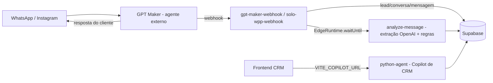

# SE-STUDY-003 — Agente de atendimento no Agno: estudo de viabilidade

| Campo | Valor |
|---|---|
| Projeto | saas-salesengine-v1.0 |
| Tarefa | SE-STUDY-003 |
| Agent | verboo |
| Data | 2026-09-14 |
| Escopo | READ-ONLY (zero mudanças de código; sem migração; sem escrita em banco) |

## Sumário executivo (curto)

**Veredito: viável com ressalvas.** A infraestrutura Agno do `python-agent` já contém quase todas
as peças de cognição reutilizáveis (fábrica de modelos, persistência de sessão, RAG por tenant,
créditos idempotentes, telemetria SSE, autenticação multi-tenant, roteador de custo, fila de
ingestão com gate, aprovações com HITL e um chat interno com streaming que prova o padrão
pergunta → ferramentas → resposta). O contrato `INBOUND_AGENT_CONTRACT.md` já desenha a fronteira
transporte ↔ cognição e o gatilho `conversation`. O que falta é a camada de canal de atendimento
(adapter WhatsApp/Instagram/webchat, resolução de tenant a partir do canal, roteamento de
identidade, handoff humano, entrega outbound, fila por conversa com retry/DLQ e disciplina de
idempotência fim a fim). O GPT Maker hoje é, na prática, transporte + CRUD de CRM + um motor de
regras/extração com `TODO`/mock no provider TypeScript; o cérebro real pode migrar para o Agno
sem reescrever o transporte. Convivência em fases com kill-switch por equipe e por canal é o
caminho seguro.

---

## 1. Inventário do `python-agent`: o que serve ao conversacional e o que é específico de CRM

### Resposta

O núcleo genérico (FastAPI, sessão Agno, fábrica de modelos, RAG, créditos, eventos, segurança)
serve ao agente de atendimento com ajustes pequenos. A cascata (tower/floor/doorman, shaper,
worker, workflow) é específica de CRM, mas contém padrões reaproveitáveis (roteador de custo,
memória por usuário, executor com HITL, medição idempotente).

### Evidências

- `python-agent/app/main.py` — monta os roteadores e o tratamento de falha do provedor:
  `app.include_router(shape.router...)`, `app.include_router(sync.router...)`,
  `app.include_router(ingest.router...)`, `app.include_router(approvals.router...)`,
  `app.include_router(chat.router...)`, `async def health()->dict: return {"status":"ok"}`,
  handler `ModelProviderError → 502` com mensagem que cita `LLM_API_KEY / LLM_BASE_URL`.
- `python-agent/app/agno_store.py` — sessão Agno em Postgres:
  `return postgres_db_cls(db_url=_normalize_postgres_url(settings.database_url), db_schema=settings.agno_schema, create_schema=False)`,
  `def session_id_for_opportunity...`, `def get_storage()`, `def get_memory()`.
- `python-agent/app/llm.py` — fábrica central:
  `LLM_BASE_URL / LLM_API_KEY ... Unset→OPENAI_API_KEY`,
  `return OpenAIChat(**kwargs)` com `kwargs["role_map"]={"system":"system"...}` para roteador
  compatível, `class ModelProviderError(RuntimeError)`, `structured_output_kwargs(schema)`,
  `parse_model_output(content,schema)`, `build_reasoning_model(model_id, effort)`.
- `python-agent/app/config.py` — tudo por variável de ambiente:
  `doorman_model="deepseek-v4-flash-0731"`, `worker_model=...`, `shaper_model=...`,
  `strategic_model=...`, `chat_model: str|None=None`, `keeper_model: str|None=None`,
  `copilot_workflow_enabled: bool=False`, `ingest_enabled: bool=False`,
  `copilot_jobs_enabled: bool=False`, `agno_schema="agno"`, CORS com `cors_origins` e
  `cors_origin_regex`.
- `python-agent/app/knowledge.py` — RAG por tenant, hoje sem agente ligado:
  `Wired into NO agent this sprint... Sprint 6.2's in-house conversational agent... can do tenant-scoped hybrid retrieval`,
  `KNOWLEDGE_TABLE="copilot_knowledge"`, `PgVector(search_type=hybrid)`,
  `OpenAIEmbedder(id="text-embedding-3-small")`, `tenant_filter={"equipe_id":equipe_id}`,
  `build_knowledge(equipe_id)`, `ingest()` sempre com `equipe_id`.
- `python-agent/app/credits.py` — razão idempotente:
  `client.rpc("charge_credits",{"p_equipe_id":equipe_id...p_idempotency_key...})`,
  `if "insufficient_credits" in message: raise InsufficientCredits`,
  `get_balance` lê `agent_credits_balance`, `check_credits` pré-voo `{allowed,balance,deficit}`.
- `python-agent/app/metering.py` — cobra 1 crédito só após `ActionResult.success`:
  `if not isinstance(result,ActionResult) or not result.success: return result`,
  chave `f"{run_id}:{function_name}:{digest}"`, falha de medição vira `metering_error` sem
  quebrar a ação.
- `python-agent/app/events.py` — telemetria com SSE:
  `await self._q.put(ev)`, `await asyncio.to_thread(self._persist,ev)`,
  persiste em `copilot_run_events`, `if kind=="done": await self._q.put(None)`.
- `python-agent/app/security.py` + `app/deps.py` — multi-tenant pronto:
  `TenantContext(equipe_id,actor_user_id,role)`, `tenant_from_jwt(authorization)` com
  HS256 legado + `ES256/RS256/EdDSA` via `jwt.PyJWKClient(f"{base}/auth/v1/.well-known/jwks.json")`,
  busca `profiles → equipe_id`; `get_tenant_context` injeta via `Depends`.
- `python-agent/app/guards.py` — padrão lista de tabelas + checagem de tenant:
  `ALLOWED_TABLES={"opportunities","pipeline_stages_v2","custom_table_records","leads","tasks"...}`,
  `assert_table`, `assert_equipe` com `Tenant violation`.
- `python-agent/app/copilot/chat.py` — prova viva do padrão conversacional interno:
  `plan (MAX_CALLS=3) → tools em paralelo → answer em streaming`,
  `answer_stream(equipe_id,user_id,thread_id,question,deps)`,
  eventos `thread/tools/delta/done/error`, `ChatStore` em `copilot_threads/copilot_messages`,
  `suspended` via `tenant_is_suspended` antes de qualquer chamada ao modelo,
  `history(thread_id,6)`, métricas `planner_ms/tools_ms/answer_ms/total_ms`,
  prompts `PLANNER_PT/ANSWER_PT` em PT-BR.
- `python-agent/app/routers/chat.py` — `POST /api/v1/chat` com JWT e SSE:
  `body: {"message","thread_id"?}`, `StreamingResponse(events(), media_type="text/event-stream")`,
  `yield f"data: {json.dumps(event...)}"`.
- `python-agent/app/cognition/router.py` — roteador de custo reutilizável:
  `Stakes(stage_type,deal_value,cheap_confidence)`, `select_tier → cheap|strategic`,
  `select_model` com regras por pipeline vencendo as configurações do serviço.
- `python-agent/app/cascade/agno_workflow.py` — espinha dorsal atual:
  `run_workflow(ctx,lead_id,opportunity_id,pipeline_id,trigger,client,emit)`,
  sequência Tower → Enricher → Floor → `select_model(Stakes)` → `run_plan` medido → HITL,
  modos `observe/suggest/autonomous`, `threshold 0.75`, `high-stakes won/lost`,
  `charge_fn=charge_credit, check_fn=check_credits`.
- `python-agent/app/cascade/enricher.py` — memória por usuário:
  `agent_kwargs["db"]=storage`, `agent_kwargs["enable_agentic_memory"]=True`,
  `agent_kwargs["user_id"]=lead_id`, verbos só `set_field/set_contact_field`,
  `Proponha APENAS valores com evidência EXPLÍCITA`, `_sanitize_plan` valida contra o
  dicionário de campos.
- `python-agent/app/routers/ingest.py` — fila com gate (hoje desligada, ver §5):
  `503 if settings.ingest_enabled is False`, `401` sem `X-Agent-Token`,
  lê `copilot_ingest_queue (processed_at IS NULL AND due_at <= now())`,
  pula equipe com `is_crm_agent_enabled=false`, `run_cascade(trigger="ingest")`,
  não marca processado em erro (retry no próximo poll), `POST /ingest/row` reativo
  (`net.http_post`, sub-2s, idempotente contra o cron).
- `python-agent/app/routers/approvals.py` — HITL pronto:
  `POST /approvals/{decision_id}/resolve`, JWT → tenant, linha filtrada por `(id,equipe_id)`,
  `assert_equipe`, `approve → run_worker → executed/failed`, `reject → rejected`,
  `resolved_by/resolved_at`.
- Testes (52 arquivos em `python-agent/tests/`): `test_agno_workflow.py`,
  `test_agno_agent_contract.py`, `test_agno_store.py`, `test_chat.py`, `test_chat_tools.py`,
  `test_ingest_router.py`, `test_approvals_router.py`, `test_credits.py`, `test_metering.py`,
  `test_knowledge.py`, `test_guards.py`, `test_security.py`, `test_sync_router.py` etc.

### Implicação prática

Não é preciso criar um segundo serviço. O mesmo FastAPI pode hospedar o novo gatilho de
conversa; a sessão Agno troca a chave (`opportunity_id` → `conversation_ref`), o RAG já espera
esse uso, e o chat interno serve de molde para o respondedor voltado ao cliente.

---

## 2. O rebaixamento do GPT Maker: o que é agente, o que é canal, fronteira exata

### Resposta

O GPT Maker hoje opera em três camadas: (a) transporte de canal (webhooks inbound, normalização,
dedup, conversa/mensagem/lead), (b) CRUD de CRM e motor de regras/extração (`analyze-message`,
`resolveActiveOpportunity`, regras por pipeline), (c) configuração de agente via API externa
(`api.gptmaker.ai/v2`) e via stubs no frontend. Só (a) e parte de (b) sobrevivem como canal;
a inteligência (responder, extrair, decidir) migra para o Agno.

### Evidências

- `src/services/ai-studio/providers/GPTMakerProvider.ts` — provedor sem integração real:
  `// Mocked implementation based on HTML context`,
  `return { creditsAvailable: 1464, ... }`,
  `console.log('[GPTMakerProvider] Creating training block:', data); // TODO: Implement actual API integration`,
  idem `manageIntentions`; `// T7: getModels() removed — the catalog is served by the edge function`.
- `src/services/ai-studio/ProviderFactory.ts` — provedor único por padrão:
  `this.instance = new GPTMakerProvider({ apiKey: ... })`, `static setProvider(provider)`.
- `src/services/ai-studio/AIProvider.ts` — contrato mínimo:
  `abstract getUsage()`, `abstract createTrainingBlock()`, `abstract manageIntentions()`.
- `supabase/functions/gpt-maker-webhook/index.ts` (699 linhas) — transporte + CRM, não cérebro:
  ignora `payload.role==='tool'`; normaliza `payload.message||payload.content||payload.text` e
  `payload.contactPhone||payload.phone||payload.from` com `normalizePhone`;
  descarta nome técnico `endsWith('@lid'/'@s.whatsapp.net'/'@c.us'/'@g.us'/'@broadcast')` ou
  `/^\d{8,}$/`; resolve equipe por `.eq('gpt_maker_agent_id', assistantId)`;
  busca lead por `phone_normalized` + `equipe_id` e por `gpt_maker_chat_id`;
  cria lead com `UNIQUE (equipe_id, phone_normalized)` e re-leitura em `23505`;
  upsert de conversa em 3 níveis (lead+canal → chat_id → lead) com reabertura de arquivada;
  `resolveActiveOpportunity(... createIfMissing:true ... entryOfKind 'agent')` +
  `recordTouch(messageTouchPayload)` só em chegada; dedup por `gpt_message_id` + janela
  (`agent 300s / customer 60s`, eco de saída 30s com `sender_id`);
  salva em `messages`, incrementa `increment_conversation_unread_count` (+ legado
  `increment_unread_count`); dispara `analyze-message` via `EdgeRuntime.waitUntil(fetch...)`
  só se `is_crm_agent_enabled`.
- `supabase/functions/solo-wpp-webhook/index.ts` — canal próprio Evolution/whatsmiau:
  `instance/event/data.key.remoteJid`, `CONNECTION_UPDATE → wpp_instances`,
  `MESSAGES_UPSERT`, `Never log the raw envelope (contains apikey)`,
  `Always return 200; never 5xx`, `Unknown instance → 200 {ignored:true}`,
  `Group/broadcast JIDs silently skipped`.
- `supabase/functions/analyze-message/index.ts` — extração + regras (cognição legada):
  `import OpenAI from esm.sh/openai@4.28.0`, `EXTRACTION_TOOL save_crm_data` com
  `intent: INTERESTED/SCHEDULED/DISQUALIFIED/SPAM/UNCHANGED`,
  `BASE_SYSTEM_PROMPT`, `MIN_NEW_MESSAGES 2 / CONTEXT 5 / LIMIT 10 / cooldown 3min`,
  `resolveActiveOpportunity`, `fetchPipelineAgentRules/evaluateTriggers/executeActions`,
  linha de auditoria `ai_decisions`-compatível.
- `supabase/functions/send-chat-message/index.ts` — entrega outbound (canal):
  `sendViaSolo` de `_shared/solo-sender.ts`, autentica via `auth.getUser()` + `profiles`,
  `loadAuthorizedContext` por `conversation_id/lead_id/chat_id`, valida `deleted/match`,
  usa `conversations (lead_id, gpt_maker_chat_id, solo_instance_id, status)`.
- `supabase/functions/manage-agent-channels/index.ts` — configuração via API externa:
  `AI_ENGINE_BASE='https://api.gptmaker.ai/v2'`, `resolveAction` com padrão `list`,
  autentica por JWT + `profiles`, lê `equipes (gpt_maker_agent_id, workspace_id)`,
  usa `pickChannelConfig` e `WEBHOOK_EVENT_DEFAULTS`.
- Demais `manage-agent-*` (settings/training/intentions/webhooks/idle-actions/transfer-rules),
  `fetch-gpt-credits`, `agent-power-sync`, `sync-chat-history`, `golive-tenant`,
  `provision-tenant`, `manage-solo-instances` — nomes e cabeçalhos lidos indicam
  configuração do agente externo e ciclo de vida de tenant; conteúdo detalhado não foi
  necessário para a fronteira (HIPÓTESE: parte do provisionamento carrega chaves e URLs do
  GPT Maker e precisará de revisão caso a caso).
- `src/services/copilot.ts` — lado Agno no frontend:
  `VITE_COPILOT_URL`, `shapePreview/shapeApply/syncOpportunity/sweep/resolveApproval`,
  bearer Supabase a cada chamada; nenhuma menção ao GPT Maker nesse arquivo.
- Migrações: `20260608000000_sprint6_copilot_config.sql` estende `pipeline_agent_rules`
  (`reasoning_enabled, tools_enabled, enabled_skills, confidence_threshold, autonomy_cost_ceiling,
  doorman_model, worker_model`); `20260620000000_sprint64_w3_copilot_agents.sql` cria
  `copilot_agents (equipe_id, scope chat/contact_base/pipeline, pipeline_id, name, system_prompt,
  autonomy_mode observe/suggest/autonomous)` com índices únicos e RLS por `equipe_id-via-profiles`.

### Fronteira exata proposta

Fica no canal (edge functions + `_shared` + tabelas de transporte): normalização, dedup,
lead/conversa/mensagem, `resolveActiveOpportunity`, unread, envio via provedor, webhooks de
conexão, configuração de número/conta. Vai para o Agno (python-agent): entender a mensagem,
consultar RAG e CRM, redigir a resposta, extrair dados, decidir efeitos no CRM, medir créditos,
emitir telemetria. `analyze-message` é substituído pelo respondedor Agno; `send-chat-message`
vira o renderizador do envelope outbound do contrato.

### Implicação prática

O rebaixamento é um recorte, não uma reescrita do transporte. O webhook atual continua valendo;
só troca o destino da chamada de IA (de `analyze-message` para o python-agent) e a origem do
texto de resposta (do GPT Maker para o Agno).

---

## 3. Viabilidade: o Agno pode assumir a cognição reusando contrato + sessão + LLM?

### Resposta

Sim. O contrato foi escrito exatamente para isso, a sessão e a fábrica de modelos já existem, e
o chat interno prova o ciclo completo. Falta construir o respondedor voltado ao cliente e os
adapters — nenhum deles exige trocar a base.

### Evidências

- `python-agent/docs/INBOUND_AGENT_CONTRACT.md`:
  `Status: foundation only. No conversational agent ships in Sprint 6.1`,
  `This contract is the boundary between message transport (webhooks/channels) and cognition (the Workflow)`,
  envelope `channel/tenant_ref/contact/message/conversation_ref`,
  `message.id is the idempotency key`,
  saída `replies[] + workflow{status,applied_count,pending,run_id}`,
  `equipe_id is never taken from the model or the message body`,
  `session_id = conversation_ref`, `trigger="conversation"`,
  `In order (sequential-queue)`, `Credit charges remain idempotent`,
  `Explicitly out of scope for 6.1: responder agent, prompt, channel adapters, outbound delivery`.
- `python-agent/app/agno_store.py`: `PostgresDb`, `db_schema`, `session_id_for_opportunity`
  (troca mecânica da chave para `conversation_ref`).
- `python-agent/app/llm.py`: troca de provedor e de modelos só por variável de ambiente, com
  `role_map` para roteador compatível e `ModelProviderError` mapeado para 502.
- `python-agent/app/knowledge.py`: `build_knowledge(equipe_id)` + `tenant_filter` prontos para
  o passo respondedor do contrato (`may consult app/knowledge.py`).
- `python-agent/app/copilot/chat.py` + `app/routers/chat.py`: ciclo planejar → consultar →
  responder com streaming, persistência e suspensão já operantes.
- `python-agent/app/routers/ingest.py`: disciplina de fila + gate por equipe + idempotência
  contra o cron, reutilizável para o gatilho de conversa.

### Implicação prática

A decisão técnica pode ser "sim" sem prova de conceito adicional de infraestrutura; o risco
está em produto e operação (qualidade da resposta, handoff, limites), não em fundação.

---

## 4. Arquitetura proposta: fluxo completo, onde cada peça mora, envelopes e idempotência

### Resposta

Canal continua na borda (Supabase Edge), cognição vai para o python-agent, entrega volta pela
borda. Idempotência em duas chaves: `message.id` (não processar 2x) e `idempotency_key` de
créditos (`run/conversa:verbo:hash`).

### Diagramas

Atual (transporte + cognição externa):



Proposta (transporte na borda, cognição no Agno):

```mermaid
flowchart LR
  WA[WhatsApp / Instagram / Webchat] --> WH[Edge webhook - transporte]
  WH -->|1. normaliza + dedup + resolve tenant/lead/conversa| DB[(Supabase)]
  WH -->|2. POST envelope inbound| PA[python-agent /conversation - Agno]
  PA -->|3. RAG tenant + Workflow CRM + respondedor| PA
  PA -->|4. replies[] + workflow{}| WH
  WH -->|5. send-chat-message / sendViaSolo| WA
  PA -->|run_events + ledger| DB
  FE[Frontend] --> PA
  FE --> WH
```

### Evidências por etapa

1. Transporte inbound (hoje e após): `gpt-maker-webhook` / `solo-wpp-webhook` normalizam,
   resolvem `equipe_id` (hoje por `gpt_maker_agent_id`; após, por conta do canal/instância —
   ver §5), resolvem lead/conversa, aplicam dedup e gravam `messages`.
   Trechos: `.eq('gpt_maker_agent_id', assistantId)`, `.eq('phone_normalized', phoneNorm)`,
   upsert de conversa em 3 níveis, `DEDUP_WINDOW_MS agent 300s / customer 60s`.
2. Chamada à cognição (após): a edge faz POST autenticado servidor-a-servidor ao python-agent
   com o envelope do contrato. Padrão de autenticação a reusar: `X-Agent-Token` de
   `app/routers/ingest.py` (`401` sem o token, `503` com a funcionalidade desligada).
3. Cognição (após, no python-agent): novo gatilho `conversation` em
   `agno_workflow.run_workflow` executa Tower → Enricher → Floor → executor medido (efeitos no
   CRM) + passo respondedor (RAG `build_knowledge(equipe_id)` + memória `user_id=lead_id` +
   `session_id=conversation_ref`). Padrão de resposta a reusar: `copilot/chat.py`
   (`thread/tools/delta/done/error`, `MAX_CALLS=3`, `history 6`, suspensão antes do modelo).
4. Retorno (após): o python-agent devolve o shape do contrato:
   `{"replies":[{"type":"text","text":"..."}], "workflow":{"status":"executed","applied_count":1,"pending":0,"run_id":"..."}}`;
   turno pode ter só respostas, só efeitos, ambos ou `replies:[]` (silêncio deliberado).
5. Entrega (após, na borda): `send-chat-message`/`sendViaSolo` renderiza `replies[]` no canal.
   Autenticação e autorização de conversa já existem (`loadAuthorizedContext`).
6. Idempotência: `message.id` como chave (contrato §2/§7; disciplina espelhada em
   `charge_credits(idempotency_key=...)`); dedup de conteúdo+janela como segunda linha
   (webhook); chave de crédito `run_id:verbo:hash` (metering); reativo `/ingest/row`
   idempotente contra o cron (`processed_at IS NULL`).

### Implicação prática

Cada etapa tem dono e morada definidos; a migração pode trocar uma etapa por vez (primeiro o
entendimento, depois a redação, depois a entrega) sem dia de virada único.

---

## 5. Mapa de gaps: o que não existe e precisa ser construído

### Resposta

Falta a camada de atendimento propriamente dita. A base (fila, créditos, telemetria,
aprovações, segurança) existe e precisa de extensão, não de invenção.

| Item | Existe hoje? | Esforço | Dependência |
|---|---|---|---|
| Adapter de canal no python-agent (WhatsApp/Instagram/webchat) | Não — só contrato + webhooks na borda; nenhum `whatsapp.py/instagram.py` no python-agent | P0 | `INBOUND_AGENT_CONTRACT.md §2`, `channel-config.ts`, provedor (Evolution/whatsmiau, Meta) |
| Endpoint `/conversation` (gatilho conversa) | Não — só `sync/ingest/chat`; contrato prevê `trigger conversation` | P0 | `agno_workflow.run_workflow`, `ingest.py` (autenticação/gate) |
| Respondedor voltado ao cliente (prompt, RAG, tom, limites) | Não — `chat.py` interno é o molde, não o respondedor | P0 | `knowledge.py`, `cognition/router.py`, `copilot/chat.py` |
| Resolução de tenant pelo canal | Parcial — webhook resolve por `gpt_maker_agent_id`; python-agent recebe `equipe_id` pronto via JWT ou `TenantContext role service` | P0 | `agent-context.ts`, `security.py`, tabela conta-canal → `equipe_id` |
| Roteamento lead ↔ oportunidade no python-agent | Não — só `_shared/opportunities.ts: resolveActiveOpportunity`; python-agent não cria nem vincula | P0 | `opportunities.ts`, `phone.ts`, `default_pipeline_id`, `crm_intake_pipeline` |
| Fila por conversa (ordem + concorrência) | Parcial — `copilot_ingest_queue` + `sequential-queue` documentada; sem fila por `conversation_ref` nem lock | P0 | Postgres/`copilot_ingest_queue`, `sweep.py`, `jobs.py` |
| Idempotência fim a fim (`message.id` com restrição única) | Parcial — disciplina documentada + dedup por conteúdo; sem prova de restrição única dedicada | P0 | `messages`, `charge_credits`, `copilot_run_events` |
| Handoff humano (pausar, transferir, retomar) | Não evidenciado; nenhum `handoff.py` localizado | P0 | `approvals`, `copilot_run_events`, interface de atendimento |
| Gate de créditos antes do modelo no atendimento | Parcial — `suspended` + `check_credits` + `charge_credits` existem; aplicação no fluxo de conversa ainda não existe | P0 | `credit-pricing.ts`, `agent-power.ts`, `tenant_is_suspended` |
| Multi-tenant na borda do canal (RLS, service_role contido) | Parcial — `TenantContext`, `assert_equipe`, RLS em `copilot_agents`; auditoria da borda pendente | P0 | `db.py`, `deps.py`, `security.py`, políticas Supabase |
| Aprovações para mensagens de atendimento | Parcial — roteador aprova ações de CRM, não texto ao cliente | P1 | `approvals.py`, `ai_decisions`, interface |
| Retry/DLQ + replay | Não evidenciado | P1 | fila, `metering.py`, observabilidade |
| Telemetria de atendimento (latência, tokens, custo por canal) | Parcial — `RunEmitter` + `copilot_run_events`; sem métricas por canal | P1 | `events.py`, `audit.py` |
| Streaming/timeout/ACK rápido no webhook | Parcial — SSE existe no chat interno; webhook precisa de ACK imediato + processo assíncrono | P1 | FastAPI, worker, provedor |
| Segurança/LGPD (redação de PII, retenção, consentimento) | Parcial — arquivos existem, conteúdo de PII não auditado neste estudo | P0 p/ produção BR | `audit.py`, `knowledge.py`, políticas de retenção |
| Mídia/áudio (transcrição, legenda, re-hospedagem) | Parcial — webhook extrai `images/audios/documents/videos` + `normalizeMediaType`; sem transcrição no python-agent | P1 | provedor de transcrição, armazenamento |
| Versionamento de prompt/config do respondedor | Não evidenciado (`copilot_agents.system_prompt` é o lar natural) | P1 | `copilot_agents`, `agents_config.py` |

### Implicação prática

O caminho crítico (P0) é transporte → tenant → identidade → conversa → resposta → entrega, com
portas de segurança (créditos, idempotência, handoff) desde o dia um. Todo o resto pode entrar
em ondas P1 sem bloquear o piloto.

---

## 6. Agentes existentes: como ficam o Copilot de CRM e o atendimento no mesmo runtime

### Resposta

Convivem sem conflito arquitetural: são papéis distintos sobre a mesma base, separados por
`scope`, `autonomy_mode`, chave de sessão e gatilho. Os 2 `copilot_agents` atuais e o Copilot de
CRM não precisam ser desligados nem migrados; o atendimento entra como novo `scope`/gatilho com
limites próprios.

### Evidências

- `copilot_agents`: `scope IN ('chat','contact_base','pipeline')`, `pipeline_id` nulo para
  globais, `autonomy_mode observe/suggest/autonomous`, unicidade por
  `(equipe_id,scope,pipeline_id)` e `(equipe_id,scope)`, RLS por equipe.
- `agno_workflow.run_workflow`: `mode manual/auto` por gatilho, `actor copilot/sync`,
  portas `observe` (só registra), `suggest` (sempre HITL + nota `[Copilot] Ação sugerida`),
  `autonomous` (executa medido), `pending_approval` para alta criticidade e baixa confiança.
- Sessões separadas: CRM usa `session_id=opportunity_id` (`agno_store`); conversa usará
  `session_id=conversation_ref` (contrato §5); memória de contato usa `user_id=lead_id`
  (`enricher.py`); chat interno usa `copilot_threads/copilot_messages` por `user_id`.
- Modelos separados por papel e por pipeline: `doorman/worker/shaper/strategic/chat/keeper`,
  `rules.get("doorman_model") or settings.doorman_model`, `select_model(Stakes)` com
  `strategic_model` e `worker_model` de reserva.
- Risco de interferência mapeado: o mesmo `Workflow` alimenta efeitos no CRM a partir dos dois
  gatilhos; a separação é por `trigger` + `run_id` + `decision_id` + telemetria, não por serviço.
  HIPÓTESE: picos de atendimento podem disputar concorrência do pool (ex.: `copilot_jobs`
  documenta pool de 4 conexões) — dimensionar e isolar limites por gatilho.

### Implicação prática

Tratar atendimento e CRM como dois produtos no mesmo motor: configurações, prompts, modelos,
tetos e telemetria separados; base (sessão, RAG, créditos, segurança) compartilhada. Nenhum
conflito exige bifurcar o repositório ou o deploy.

---

## 7. Prós, contras e trade-offs

### Fazer (Agno como cérebro, GPT Maker como canal)

Prós:

1. Controle total da resposta (prompt, RAG por tenant, roteador de custo, guardas) — hoje
   dividido entre stubs com `TODO` no frontend e caixas externas.
2. Uma razão e uma telemetria (`charge_credits` idempotente, `copilot_run_events`, SSE) em vez
   de dois mundos (créditos mock `1464` no provider contra razão real no python-agent).
3. Reuso direto: sessão, LLM, RAG, fila com gate, aprovações e chat interno já operam.
4. Menor lock-in de agente: trocar provedor e modelos por variável de ambiente (`llm.py`).
5. Observabilidade e auditoria no próprio banco (`ai_decisions`, `copilot_run_events`).

Contras:

1. Esforço P0 real (adapter, identidade, handoff, entrega, idempotência, limites) antes do
   primeiro piloto.
2. Qualidade inicial da resposta pode regredir frente ao agente externo já ajustado em
   produção — exige avaliação e ajuste de prompt/RAG.
3. Latência passa a ser responsabilidade própria (ACK rápido + assíncrono + timeouts).
4. Custo de tokens passa a ser visível e cobrado por tenant — exige portas e alertas.
5. Superfície de LGPD e multi-tenant sob responsabilidade própria (redação, retenção, RLS).

### Manter (GPT Maker como agente)

Prós: atendimento segue operando sem projeto de migração; entrega e dedup atuais continuam;
sem custo de construção imediato.

Contras: inteligência fora de casa (stubs sem integração real no provider); duas razões e duas
telemetrias; troca de modelos e prompts dependente de API externa (`api.gptmaker.ai/v2`);
evolução do Copilot e do atendimento em trilhos separados.

### Trade-offs que importam

Custo: externo diluído e opaco contra interno visível por tenant (exige precificação e tetos).
Latência: externa com rede extra contra interna com engenharia própria de fila/streaming.
Controle contra velocidade: migrar compra controle e paga esforço; manter compra tempo e paga
dependência. Qualidade: externa herdada contra interna construída (exige avaliação contínua).
Observabilidade: externa limitada contra interna completa (exige instrumentação).

---

## 8. Ferramentas adicionais: se o Agno sozinho não basta

### Resposta

O Agno cobre cognição; o entorno (fila, entrega, observação, voz/mídia, gateway) precisa de
peças padrão — nenhuma exige instalação neste estudo, só decisão.

| Necessidade | Opções concretas | Trade-off |
|---|---|---|
| Fila/worker assíncrono | Postgres (`copilot_ingest_queue` + `net.http_post` + cron, já em uso) contra fila dedicada (ex.: BullMQ/Redis, Cloud Tasks) | Postgres basta ao piloto e mantém tudo no banco; fila dedicada escala ordem/retry/DLQ por conversa com menos gambiarra |
| Orquestração de turnos | `run_workflow` + gatilho `conversation` contra orquestrador externo | Interno mantém razão e créditos juntos; externo adiciona salto de rede e segunda fonte de verdade |
| Observabilidade de LLM | Telemetria própria (`copilot_run_events`, `ai_decisions`, `metering`) contra plataforma (ex.: Langfuse, LangSmith) + Sentry/OpenTelemetry | Própria integra com CRM e RLS; plataforma acelera rastreio de prompt/token/latência e avaliação |
| Avaliação de resposta | `evals/` do repo contra conjunto externo versionado | Interno versiona junto ao código; externo facilita júri e regressão contínua (HIPÓTESE: `evals/` cobre CRM, não atendimento — confirmar caso a caso) |
| Vetores/RAG | `pgvector` + `PgVector hybrid` + `OpenAIEmbedder` (já adotados) | Suficiente; trocar só por escala ou idioma específico |
| Gateway de canais | Evolution/whatsmiau (já em uso no `solo-wpp-webhook`) + Meta Cloud API contra agregador (ex.: Twilio, 360dialog) | Direto dá controle e custo menor; agregador dá SLA, templates e suporte a mídia |
| Transcrição de áudio | Provedor de transcrição acoplado ao passo de mídia | Necessário para atendimento real; custo e latência por mensagem |
| Envio/outbound | `sendViaSolo` atual contra SDK do provedor no python-agent | Manter envio na borda preserva autenticação e contexto de conversa já auditados |

### Implicação prática

Nada exótico: fila, observabilidade, gateway e transcrição. A escolha é de escala e operação,
não de viabilidade.

---

## 9. Riscos e mitigações

| Risco | Mitigação |
|---|---|
| Quebra do atendimento em produção | Piloto por equipe/canal com `is_crm_agent_enabled` + `ingest_enabled` como kill-switch; convivência com o GPT Maker; rollback por roteamento na edge |
| Perda de histórico/contexto | Reusar `resolveActiveOpportunity`, upsert de conversa em 3 níveis, `session_id=conversation_ref` + `user_id=lead_id`; `run_id/opportunity_id/seq` em `copilot_run_events` |
| Mensagem duplicada ou perdida | `message.id` com restrição única antes de qualquer chamada ao modelo; dedup por conteúdo+janela como segunda linha; `/row` idempotente contra o cron; DLQ + replay |
| Tenant errado (vazamento entre equipes) | `equipe_id` nunca vindo da mensagem; resolução servidor-a-servidor; `TenantContext` + `assert_equipe` + filtro `(id,equipe_id)`; auditoria de `db.py/deps.py/security.py` |
| Latência e timeout do canal | ACK imediato na edge + processo assíncrono; `MAX_CALLS=3`, histórico curto (6 turnos), prazos por etapa; métricas p95 por canal |
| Custo de tokens sem teto | `suspended` + `check_credits` antes do modelo; `charge_credit` idempotente após sucesso; teto por conversa/dia; alerta e pausa (`agents_to_pause`); preços em `credit-pricing.ts` |
| Concorrência na mesma conversa | Fila por `(equipe_id, canal, external_id)` com ordem; teste de corrida; `seq` em eventos |
| LGPD e dados do cliente | Redação de PII em logs/prompts; retenção e consentimento definidos; RLS por `equipe_id`; service_role só no servidor; revisão de `phone.ts` e fluxos de mídia |
| Regressão de qualidade | Avaliação antes/depois, shadow mode (`observe`), aprovação (`suggest`) e canário antes do `autonomous` no atendimento |
| Rollback sem volta | Versionar prompts (`copilot_agents.system_prompt`) e regras; trilha em `audit.py`/`ai_decisions`; runbook com `provision-effects/notify` como referência |

Evidências de que as alavancas existem: `ingest_enabled=False` + `503/401` (`ingest.py`),
`is_crm_agent_enabled` (`ingest.py`, webhook), `observe/suggest/autonomous` (`agno_workflow.py`),
`pending_approval` (`approvals.py`), `suspended` (`copilot/chat.py`), dedup com janelas
(webhook), `23505` com re-leitura (webhook), `metering_error` sem quebrar a ação
(`metering.py`), persistência best-effort (`events.py`).

---

## 10. Plano de fases: do mínimo ao completo, com aceite e convivência

### Fase 0 — Preparação (sem tráfego)

- Congelar o contrato como especificação; mapear conta-canal → `equipe_id`; definir tetos de
  crédito e política de PII/retenção.
- Aceite: contrato assinado, matriz de tenant, tetos e runbook escritos.

### Fase 1 — Sombra (mínima, sem impacto)

- Edge espelha o inbound para o python-agent em modo `observe`: executa Tower → Enricher →
  Floor, registra decisões `proposed`, não responde, não executa.
- Aceite: `copilot_run_events` e `ai_decisions` mostram turnos sombra íntegros; zero mensagens
  enviadas; latência p95 medida.

### Fase 2 — Piloto assistido (uma equipe, um canal)

- Liga `trigger conversation` + respondedor com RAG; modo `suggest`: resposta proposta vai para
  aprovação humana; envio pela borda após aprovação; handoff manual operante.
- Aceite: taxa de aprovação, qualidade avaliada, dedup sem duplicatas, créditos cobrados
  corretamente, rollback por chave em minutos.

### Fase 3 — Piloto autônomo com rede de segurança

- Modo `autonomous` só para intenções de baixo risco; alta criticidade continua em HITL;
  fila por conversa + retry/DLQ + idempotência com restrição única; alertas de custo e
  latência.
- Aceite: p95 dentro do acordo com o canal; custo por conversa dentro do teto; zero
  vazamento entre tenants; replay da DLQ validado.

### Fase 4 — Expansão (canais e equipes)

- Instagram/webchat, mídia/áudio com transcrição, versionamento de prompt por
  `copilot_agents.system_prompt`, avaliação contínua.
- Aceite: paridade de qualidade contra o GPT Maker por canal; expansão por chave sem deploy.

### Fase 5 — Desligamento do cérebro externo

- GPT Maker restrito a transporte (quando houver número ainda nele) ou removido onde o canal
  próprio assume; `analyze-message` aposentado; `ProviderFactory` passa a expor provedor
  interno ou é removido.
- Aceite: nenhum turno resolvido fora do Agno; histórico preservado; runbook de retorno
  arquivado.

### Convivência e rollback

- Duas chaves independentes: funcionalidade (`ingest_enabled`, gatilho conversa) e
  elegibilidade (por equipe/canal, `is_crm_agent_enabled`).
- Roteamento na edge decide o destino por mensagem; voltar é mudar a chave, não fazer deploy.
- `solo-wpp-webhook` já opera como canal próprio e é o substituto natural onde o número não
  depende do GPT Maker.

---

## Apêndice — arquivos lidos (evidência)

`python-agent/docs/INBOUND_AGENT_CONTRACT.md`, `python-agent/app/main.py`,
`python-agent/app/config.py`, `python-agent/app/agno_store.py`, `python-agent/app/llm.py`,
`python-agent/app/knowledge.py`, `python-agent/app/credits.py`, `python-agent/app/metering.py`,
`python-agent/app/events.py`, `python-agent/app/guards.py`, `python-agent/app/security.py`,
`python-agent/app/deps.py`, `python-agent/app/routers/ingest.py`,
`python-agent/app/routers/chat.py`, `python-agent/app/routers/approvals.py`,
`python-agent/app/cascade/agno_workflow.py`, `python-agent/app/cascade/enricher.py`,
`python-agent/app/cognition/router.py`, `python-agent/app/copilot/chat.py`,
`src/services/ai-studio/providers/GPTMakerProvider.ts`,
`src/services/ai-studio/ProviderFactory.ts`, `src/services/ai-studio/AIProvider.ts`,
`src/services/copilot.ts`, `supabase/functions/gpt-maker-webhook/index.ts`,
`supabase/functions/solo-wpp-webhook/index.ts` (parcial),
`supabase/functions/analyze-message/index.ts` (parcial),
`supabase/functions/send-chat-message/index.ts` (parcial),
`supabase/functions/manage-agent-channels/index.ts` (parcial),
`supabase/functions/_shared/opportunities.ts` (parcial),
`supabase/migrations/20260608000000_sprint6_copilot_config.sql`,
`supabase/migrations/20260620000000_sprint64_w3_copilot_agents.sql`.

Nota de método: nenhum código foi alterado, nenhuma migração foi executada e nenhum banco foi
escrito. Valores sensíveis são referidos apenas como variáveis de ambiente e segredos, sem
citação de conteúdo. Afirmações sem trecho correspondente estão marcadas como HIPÓTESE.
